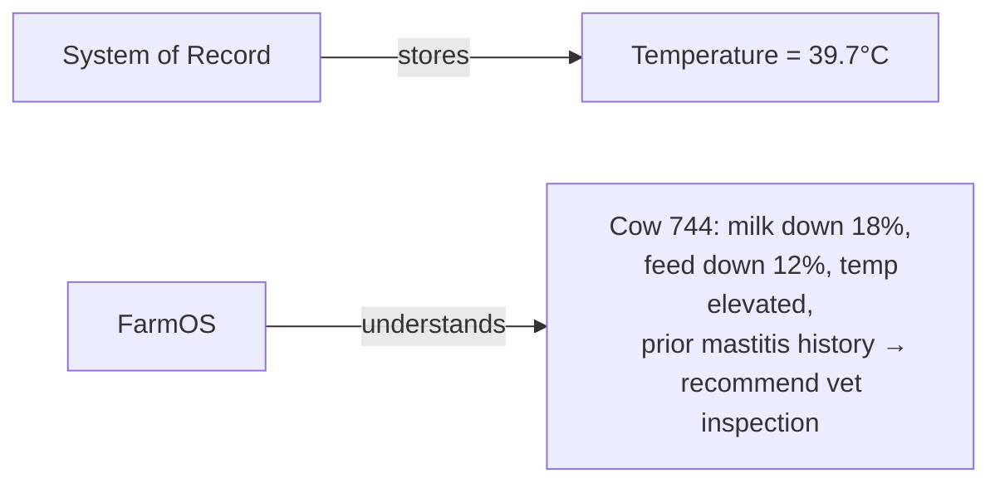
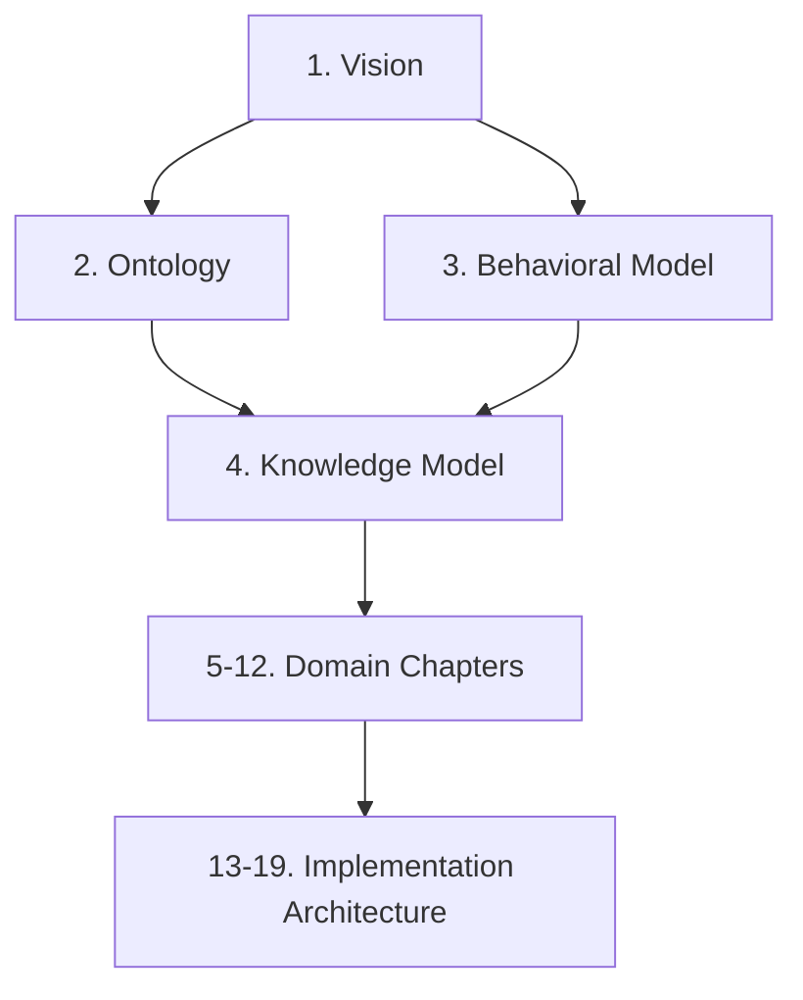

# Chapter 1 — Vision and Design Philosophy

## 1.1 Purpose

This chapter defines why FarmOS exists, who it is for, and the philosophy that every later chapter must remain consistent with.

It is the entry point of the Engineering Handbook. Every subsequent chapter (Ontology, Behavioral Model, Knowledge Model, domain workflows, and implementation architecture) must trace back to the vision defined here.

## 1.2 Mission

> FarmOS helps farmers make better decisions with less effort.

FarmOS is the intelligent operating system for a mixed farm. It is built first, and specifically, for Origami Farms, with the explicit intent to generalize to other farms only after real-world validation.

## 1.3 The Guiding Question

Every feature, screen, workflow, and data model decision must be tested against one question:

> What does the farm manager need to know and do tomorrow morning?

If a proposed feature does not help answer this question, it belongs on the roadmap, not in the MVP. See [product/MVP_SCOPE.md](../product/MVP_SCOPE.md) for how this question is applied as a decision filter.

## 1.4 Who FarmOS Is For

| Actor | Primary need |
|---|---|
| Farm Owner | Financial performance, oversight, trust that operations are under control |
| Farm Manager | A daily briefing telling them what needs attention, and evidence to act on |
| Worker | The fastest possible way to record what they did and what they saw |
| Veterinarian | Reliable, structured medical history and observation evidence |
| Accountant / Finance User | Clean sales, expense, and profitability data without full bookkeeping overhead |

FarmOS is designed around these people and their real workflows, not around generic software modules (see [Chapter 3 — Behavioral Model](03-Behavioral-Model.md)).

## 1.5 Product Differentiation

A traditional farm system of record answers: **What happened?**

FarmOS must answer: **What does it mean, what should we watch, and what should the farm manager do?**

This transformation — Observations → Information → Knowledge → Recommendations → Decisions → Outcomes → Learning — is the central product differentiator and is specified fully in [Chapter 4 — Farm Knowledge Model](04-Knowledge-Model/README.md).

## 1.6 Core Design Principles

These principles restate, at product level, the non-negotiables already ratified in the [Constitution](../CONSTITUTION.md). Where the Constitution defines the rule, this section explains the product reasoning.

### 1.6.1 Origami Farms First

The MVP is scoped to one real farm's real problems. Generalization is a Phase 8 concern (see [product/ROADMAP.md](../product/ROADMAP.md)), not an MVP concern. Designing for hypothetical future customers before the first customer is proven is explicitly rejected.

### 1.6.2 Offline First

A farm does not stop operating because a barn has no signal. Every critical workflow — animal lookup, feeding, milking, egg collection, health observation, treatment, inventory usage, task completion, sales, and expenses — must work with zero connectivity and sync later.

### 1.6.3 Tablet First

The primary device is an Android tablet used standing up, often with one free hand, in a barn, stable, or field. The test for every screen is:

> If a worker cannot complete the task with one hand while standing in the barn, the design is wrong.

### 1.6.4 Observation Before Diagnosis

Workers record what they see. Veterinarians diagnose. Managers decide. FarmOS correlates. This separation of roles is what keeps farm data objective and keeps FarmOS legally and professionally safe (see [4.1 Purpose and Philosophy](04-Knowledge-Model/04.1-Purpose-and-Philosophy.md)).

### 1.6.5 Evidence Before Opinion

No recommendation is shown without the observations, trends, historical context, confidence level, and suggested action that produced it. Black-box outputs are prohibited.

### 1.6.6 One Digital Twin per Object

Every physical thing on the farm — animal, flock, field, barn, product, feed item, medicine, asset, customer, supplier — exists as exactly one digital representation that everything else connects to (see [Chapter 2 — Ontology](02-Ontology.md)).

### 1.6.7 Event-Driven History

Nothing is silently overwritten. Corrections are new events, not deletions (see [Chapter 3 — Behavioral Model](03-Behavioral-Model.md)).

### 1.6.8 AI Advises, Humans Decide

AI recommends; it never diagnoses as fact, prescribes, or acts irreversibly without human approval.

## 1.7 What FarmOS Is Not

To keep the product focused, FarmOS explicitly is **not**, at least for the MVP:

- A generic multi-tenant commercial SaaS product.
- A full accounting or payroll system.
- An IoT/sensor/hardware platform.
- A veterinary diagnostic or telemedicine tool.
- A chatbot-first AI product.

These may become true in later phases (see [product/ROADMAP.md](../product/ROADMAP.md)), but the MVP must not be designed as if they were already required.

## 1.8 Success Definition

FarmOS's MVP is successful when:

- The farm manager uses it daily, unprompted.
- Workers complete core tasks without heavy training.
- The morning briefing is the natural entry point to the day.
- Feed, milk, eggs, health, produce, sales, and expenses are captured consistently.
- Health alerts are evidence-based rather than anecdotal.
- Origami Farms would keep using FarmOS even if it were never commercialized.

This last point is the strongest success signal FarmOS has, and it is the standard every later chapter's acceptance criteria should be measured against.

## 1.9 Relationship to the Rest of the Handbook

- [Chapter 2 — Ontology](02-Ontology.md) defines the nouns of the farm.
- [Chapter 3 — Behavioral Model](03-Behavioral-Model.md) defines how those nouns behave and change state.
- [Chapter 4 — Farm Knowledge Model](04-Knowledge-Model/README.md) defines how observations of those nouns become recommendations.
- Chapters 5-12 define each domain (Animal Digital Twin, Feed, Dairy, Poultry, Veterinary, Inventory, Produce, Sales & Finance).
- Chapters 13-19 define how it is actually built (UI/UX, database, API, sync, security, testing, deployment).

## 1.10 Codex Implementation Notes

- Do not start implementation from a generic farm-management template. Start from the entities and workflows in this handbook.
- When a requirement is ambiguous, resolve it using the guiding question in §1.3, not by adding configurability.
- Every feature branch or module should be traceable to a chapter and section of this handbook (see [product/TRACEABILITY.md](../product/TRACEABILITY.md)).

## 1.11 Acceptance Criteria

This chapter is satisfied when:

- Every later handbook chapter can point back to a principle in this document for its rationale.
- No MVP feature exists in the backlog that fails the guiding question test in §1.3.
- The product differentiation in §1.5 is demonstrable in the morning briefing and recommendation UI once built.
