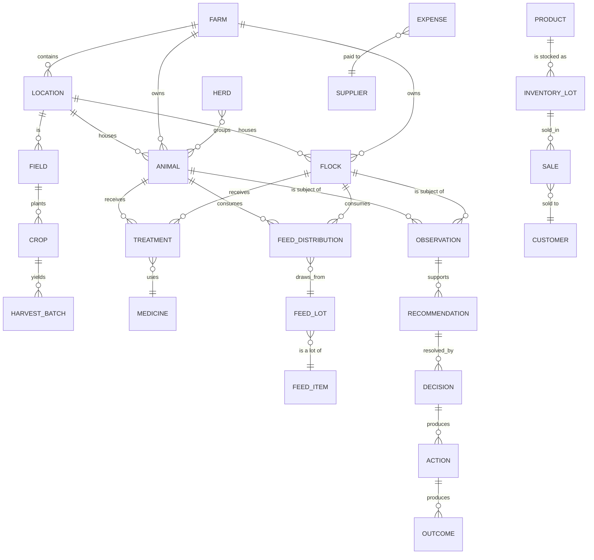

# Chapter 2 — Farm Ontology

## 2.1 Purpose

The Farm Ontology defines the complete set of real-world entities FarmOS represents, their relationships, and the digital twin rule that governs how each is modeled. This is the conceptual model — the definitive database schema is specified in [Chapter 14 — Database Architecture](14-Database-Architecture/14-Database-Architecture.md); this chapter defines *what* exists, not *how* it is stored.

Every entity in this ontology must satisfy Constitution Principle 3 (Digital Twin): exactly one authoritative digital representation per real-world object.

## 2.2 Entity Classes

FarmOS entities fall into six classes:

| Class | Purpose | Examples |
|---|---|---|
| Organizational | Structure of the farm itself | Farm, Barn, Field, Pen, Location |
| Living Entities | Animals and groups of animals | Animal, Flock, Herd |
| Botanical Entities | Crops and produce | Field, Crop, Planting, Harvest Batch |
| Resource | Consumable and durable resources | Feed Item, Medicine, Asset, Product, Inventory Lot |
| Business | Commercial relationships | Customer, Supplier, Sale, Expense |
| Knowledge | The knowledge lifecycle itself (Chapter 4) | Observation, Recommendation, Decision, Event |

## 2.3 Core Entity Catalog

### 2.3.1 Farm

The top-level tenant boundary. In the MVP there is exactly one Farm (Origami Farms); the schema supports more than one to avoid a costly rewrite at Phase 8 (multi-farm), without building multi-tenant features early.

### 2.3.2 Location (Barn / Field / Pen)

A physical place on the farm. Animals, flocks, and crops are always located somewhere. Locations have a type (barn, pasture, field, pen, storage) and can nest (a pen belongs to a barn).

### 2.3.3 Animal

A single living animal — cow, sheep, goat, horse. This is the Animal Digital Twin, specified fully in [Chapter 5](05-Animal-Digital-Twin/05-Animal-Digital-Twin.md). Identity, species, breed, sex, age/birthdate, current location, and current health/production/breeding state all attach to this one entity.

### 2.3.4 Flock

A managed group of poultry (chickens, ducks, turkeys) tracked collectively rather than individually, because individual-bird tracking is not operationally realistic. A Flock is its own digital twin with its own production history (egg collection), health observations, and feed allocation.

### 2.3.5 Herd

An optional grouping of Animals (e.g., "milking herd," "dry herd," "young stock") used for feeding and task assignment. A Herd does not replace the Animal digital twin — it is a management grouping over existing Animal twins.

### 2.3.6 Field / Crop / Harvest Batch

A Field is a location used for planting. A Crop is what is planted in a field for a season (planting date, expected harvest date). A Harvest Batch is the output of harvesting a crop — quantity, unit, waste, and the input/labor/packaging costs allocated to it (see [Chapter 11 — Produce](11-Produce/11-Produce-Management.md)).

### 2.3.7 Feed Item / Feed Lot

A Feed Item is a type of feed (e.g., "layer mash," "alfalfa hay"). A Feed Lot is a specific purchased or produced batch of that feed item with a quantity, unit cost, and current stock level (see [Chapter 6 — Feed](06-Feed/06-Feed-Management.md)).

### 2.3.8 Medicine / Treatment

A Medicine is a type of drug or vaccine with an associated default withdrawal period. A Treatment is an event applying a Medicine to an Animal or Flock (see [Chapter 9 — Veterinary](09-Veterinary/09-Veterinary-Management.md)).

### 2.3.9 Product / Inventory Lot

A Product is a sellable item (raw milk, eggs, cheese, labneh, a harvested crop). An Inventory Lot is a specific quantity of a Product in stock, produced on a date, with a source reference (which milking, which harvest, which processing batch).

### 2.3.10 Customer / Supplier

External parties FarmOS transacts with. Sales reference a Customer; purchases (feed, medicine, other expenses) reference a Supplier.

### 2.3.11 Asset

A durable piece of equipment or infrastructure (MVP-Light — basic register only; see [product/MVP_SCOPE.md](../product/MVP_SCOPE.md)).

### 2.3.12 User

A person with a role (Farm Owner, Farm Manager, Worker, Veterinarian, Accountant/Finance, Read-Only) as defined in the concept note §13 and formalized in [Chapter 17 — Security](17-Security/17-Security.md).

### 2.3.13 Knowledge Entities

Observation, Validation Result, Knowledge Object, Recommendation, Decision, Action, Outcome, and Learning Signal are defined fully in [Chapter 4 — Farm Knowledge Model](04-Knowledge-Model/README.md). They are listed here because every entity above can be the subject of an Observation.

## 2.4 Relationship Model

## 2.5 The Digital Twin Rule

### RULE-ONT-101 — One Twin per Entity

Every real-world object listed in §2.3 SHALL have exactly one digital twin record. No workflow may create a second, competing record for the same physical object.

### RULE-ONT-102 — Everything Attaches to the Twin

Milk records, feed records, medical records, breeding records, costs, photos, observations, and recommendations for a given Animal SHALL reference that Animal's single digital twin ID, never a duplicate or a denormalized copy.

### RULE-ONT-103 — Groups Do Not Replace Individuals

A Herd is a grouping over Animal twins for convenience (feeding, task assignment). It SHALL NOT be used as a substitute for individual Animal records where individual tracking is operationally meaningful (e.g., milk yield, health history, breeding).

### RULE-ONT-104 — Flocks Are Twins Too

Because individual poultry tracking is not realistic, the Flock itself — not each bird — is the digital twin for poultry. Flock-level production, feed, and health data attach to the Flock.

## 2.6 The Five-Minute Test

Per the concept note (§10):

> If this animal disappeared tomorrow, could another farm manager understand its life in under five minutes?

This is the acceptance test for the Animal (and, by extension, Flock and Field) digital twin: identity, current state, and full history must be viewable from one place.

## 2.7 Functional Requirements

### REQ-ONT-201

FarmOS shall assign every entity a stable, unique, farm-scoped identifier that never changes across the entity's lifetime, even across offline/online sync.

### REQ-ONT-202

FarmOS shall support QR-code generation and lookup for Animal, Flock, Location, and Feed Lot entities (tablet-first, one-hand lookup).

### REQ-ONT-203

FarmOS shall never require a species-specific data model fork. Cows, sheep, goats, and horses share the Animal entity with a `species` attribute; chickens, ducks, and turkeys share the Flock entity with a `species` attribute (Constitution Principle 16 — Mixed Farm by Design).

## 2.8 Codex Implementation Notes

- Model Animal and Flock as the two "living entity" root types; do not create a separate table per species.
- Every entity table needs a farm-scoped ID, a `created_at` event reference, and a soft `active`/`archived` status — never hard-delete a digital twin.
- Build Location as a self-referencing hierarchy (barn → pen) rather than a fixed set of location types.
- Treat Herd as a many-to-many join table over Animal, not a new twin type.

## 2.9 Acceptance Criteria

This chapter is satisfied when:

- Every entity referenced by Chapters 5-12 traces back to an entity defined here.
- No two workflows in the handbook create competing representations of the same real-world object.
- The relationship model in §2.4 has no orphaned entities (every entity connects to Farm, directly or transitively).
