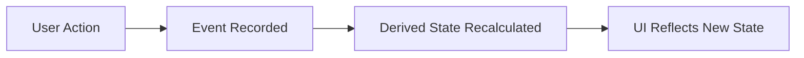
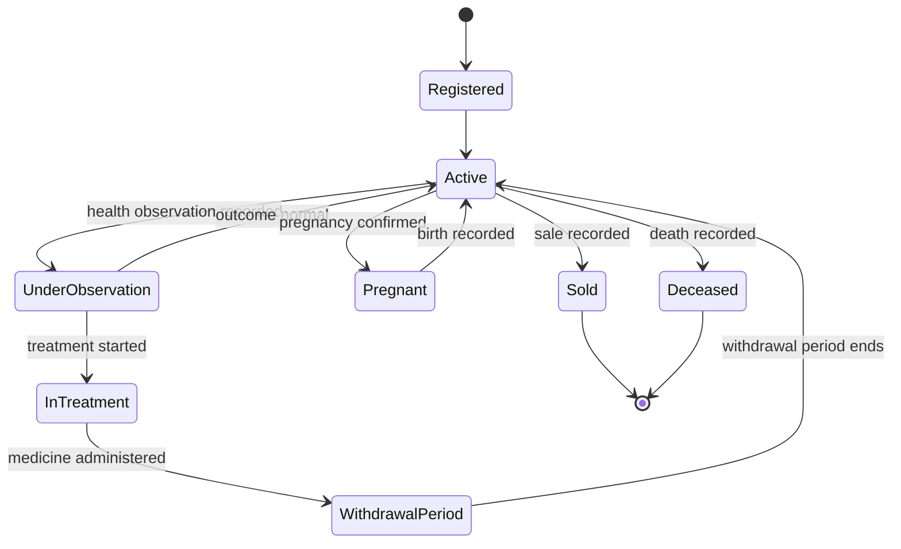
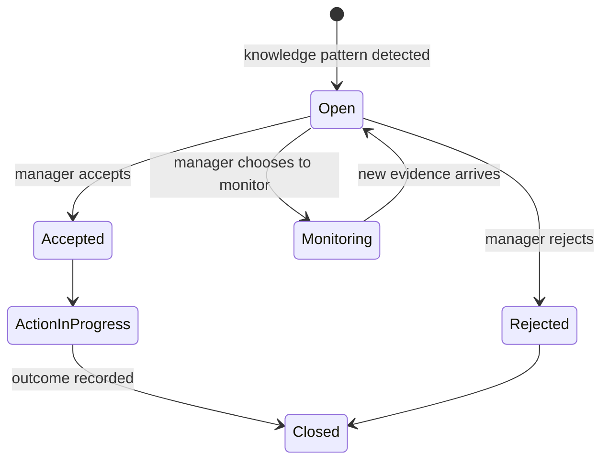
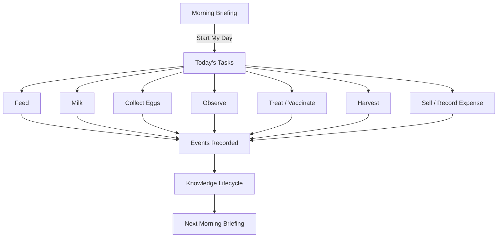
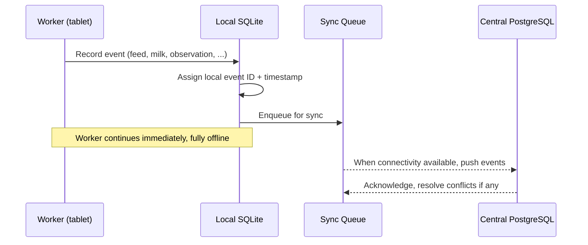

# Chapter 3 — Behavioral Model

## 3.1 Purpose

The Ontology (Chapter 2) defines the nouns of FarmOS. This chapter defines the verbs: how entities change state over time, how the system responds to user actions, and how it behaves offline. Every workflow chapter (5-12) implements the patterns defined here rather than inventing its own.

## 3.2 The Governing Rule: Nothing Changes Without an Event

Per Constitution Principle 4, every state transition SHALL be traceable to one or more events. FarmOS never allows a direct, un-audited field update to a digital twin's history-bearing attributes (health state, production totals, inventory levels, financial balances). Instead:

Current state (e.g., "Cow 744 is currently lactating," "Feed Lot #12 has 340 kg remaining") is always a *derived projection* of the event history, never a value edited in place.

### RULE-BM-101 — Corrections Are Events

If a worker records the wrong value, FarmOS records a correction event referencing the original, rather than editing or deleting it. The audit trail always shows both.

### RULE-BM-102 — Derived State Is Recomputable

Any derived state field must be reproducible by replaying the entity's event history from scratch. If it cannot be, the design is wrong.

## 3.3 Entity Lifecycles

### 3.3.1 Animal Lifecycle

An Animal's lifecycle state is always a projection of its event history (registration, observations, treatments, breeding events, sale, death) — never a manually-set status field alone.

### 3.3.2 Flock Lifecycle

Flocks follow a simpler lifecycle: Registered → Active → (production tracked continuously) → Retired/Culled. Health and withdrawal states apply at the flock level rather than per-bird.

### 3.3.3 Recommendation Lifecycle

This lifecycle is specified in depth in [4.2 Knowledge Lifecycle](04-Knowledge-Model/04.2-Knowledge-Lifecycle.md) and [4.6 Decision Intelligence](04-Knowledge-Model/04.6-Decision-Intelligence.md).

### 3.3.4 Withdrawal Period Behavior

While an Animal or Flock is within an active withdrawal period after treatment, FarmOS must behave defensively:

### RULE-BM-103 — Withdrawal Blocking

FarmOS SHALL warn, and by default block, any sale or consumption record for milk, eggs, or meat originating from an Animal or Flock with an active withdrawal period, until an authorized user overrides with a recorded reason.

### 3.3.5 Task Lifecycle

Tasks (feed this barn, follow up on this animal, harvest this field) move through: Suggested/Scheduled → Assigned → In Progress → Completed/Skipped. A skipped task is retained, not deleted, so the manager can see what did not happen.

## 3.4 The Daily Behavioral Loop

FarmOS's primary behavioral rhythm is not "open the app and browse a dashboard." It is a loop anchored to the Morning Briefing:

Every quick action in §3.4 maps to a workflow chapter (5-12) and every workflow emits events that feed the Knowledge Lifecycle (Chapter 4), which in turn shapes the next Morning Briefing.

## 3.5 Offline Behavior

### RULE-BM-104 — Offline Is the Default Assumption

Every workflow must be designed assuming zero connectivity at the moment of use. Connectivity is treated as an enhancement, never a precondition.

### 3.5.1 Local-First Write Path

All critical workflows (§4.2 of the Constitution / concept note §4.2) save locally first and confirm to the user immediately. Sync to the central database is asynchronous and never blocks the workflow.

### 3.5.2 Conflict Behavior

### RULE-BM-105 — No Silent Overwrites

When the same entity is modified from two offline sources before sync, FarmOS SHALL preserve both events with their original local timestamps and flag the conflict for manager review. It SHALL NOT silently pick one and discard the other.

This is elaborated in [Chapter 16 — Offline Synchronization](16-Offline-Synchronization/16-Offline-Synchronization.md).

## 3.6 Role-Driven Behavior

Behavior is gated by role (see concept note §13, formalized in [Chapter 17 — Security](17-Security/17-Security.md)):

| Behavior | Worker | Farm Manager | Veterinarian | Owner |
|---|---|---|---|---|
| Record observation | Yes | Yes | Yes | Yes |
| Enter diagnosis | No | No (unless authorized) | Yes | No |
| Accept/reject recommendation | No | Yes | Yes (health only) | Yes |
| Approve financial record | No | Yes | No | Yes |
| Configure farm | No | Limited | No | Yes |

### RULE-BM-106 — Workers Cannot Diagnose

The data entry surface available to a Worker role SHALL NOT include a diagnosis field. Diagnosis fields are only presented to Veterinarian and explicitly authorized roles, per Constitution Principle 5.

## 3.7 Missing-Data Behavior

### RULE-BM-107 — Absence Is Not Evidence of Normalcy

If an expected observation is missing (e.g., no milk entry for a lactating cow today), FarmOS SHALL treat this as "unknown," generate a reminder or alert, and SHALL NOT treat the absence as a positive signal in any recommendation (see [4.1 Purpose and Philosophy §4.1.4](04-Knowledge-Model/04.1-Purpose-and-Philosophy.md)).

## 3.8 Functional Requirements

### REQ-BM-201

FarmOS shall derive all entity current-state views from replayable event history.

### REQ-BM-202

FarmOS shall queue all offline writes locally and sync them without requiring user intervention beyond connectivity.

### REQ-BM-203

FarmOS shall block or warn on any withdrawal-period violation at the point of sale or consumption recording, not only in reports.

### REQ-BM-204

FarmOS shall present role-appropriate data entry surfaces, hiding diagnosis and configuration behaviors from unauthorized roles at the UI layer, enforced again at the API layer.

## 3.9 Codex Implementation Notes

- Implement entities as append-only event logs with a materialized "current state" projection, not as mutable rows with an audit-log bolted on afterward.
- Build the offline write path (local SQLite + sync queue) before building any screen that assumes a live connection.
- Treat role-based UI hiding as a convenience, not a security boundary — always re-check permissions server-side (see [Chapter 17 — Security](17-Security/17-Security.md)).
- Withdrawal-period checks belong in the same transaction as the sale/consumption event, not as a background report.

## 3.10 Acceptance Criteria

This chapter is satisfied when:

- Every workflow chapter (5-12) describes its state transitions in terms of events, not direct field edits.
- A full sync-conflict scenario can be demonstrated without data loss.
- A withdrawal-period sale attempt can be demonstrated being blocked at entry time.
- The Morning Briefing can be shown to reflect events recorded the previous day.
