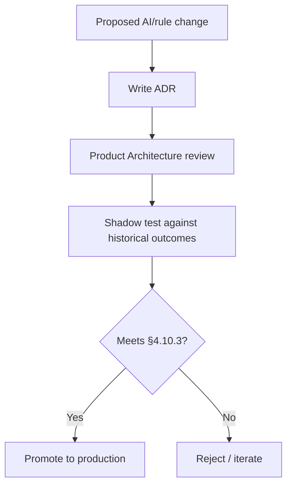

# 4.10 AI Governance

## 4.10.1 Purpose

This section is the closing chapter of the Knowledge Model: the governance boundary that constrains everything from §4.4-4.9, now and as FarmOS's intelligence evolves beyond rule-based correlation. It exists to guarantee that Constitution Principle 7 (Human Decision Authority) and Principle 17 (AI Is a Copilot) hold regardless of which technique — rules today, statistical models tomorrow — powers the Knowledge Model.

## 4.10.2 Scope of AI in FarmOS

| In scope for AI | Out of scope for AI (human-only) |
|---|---|
| Detecting patterns across observations | Diagnosing disease as fact |
| Detecting anomalies and trends | Prescribing medication or dosage |
| Predicting risk (e.g., feed shortfall date) | Executing irreversible actions (sale, cull, treatment) |
| Generating explainable recommendations | Overriding a manager's or veterinarian's decision |
| Explaining its own reasoning | Concealing uncertainty or confidence |

### RULE-KM-1001 — Scope Is Enforced at the Data Model, Not Just Policy

Diagnosis and prescription fields SHALL NOT exist on Recommendation or Knowledge Object entities. This is a structural constraint, not merely a UI convention, so that no future feature can casually reintroduce AI-as-diagnostician by adding a field.

## 4.10.3 Governance Requirements for Any Model Introduced Post-MVP

Constitution Principle 19 (Architecture Before Implementation) applies specifically here: no statistical or machine-learned component may be introduced into the Recommendation Engine (§4.5) without satisfying all of the following, reviewed as an ADR (see [handbook/adr](../adr/README.md)):

1. **Explainability parity** — the model's output must satisfy the six-question explanation contract (§4.7.2) exactly as the rule-based engine does today. A model that cannot explain itself in those terms cannot ship.
2. **Human review gate** — a new model version is validated against historical outcomes before being promoted to production, and its predictions are shadow-tested alongside the existing rule-based engine before replacing it.
3. **Confidence calibration** — the model must expose a genuine confidence score, not a fixed placeholder, and that score must correlate with actual historical accuracy (§4.9.6 Knowledge Maturity Index).
4. **Auditability** — every recommendation produced by a model records which model version produced it, alongside the same evidence trail required of rule-based recommendations (§4.5.3).
5. **Reversibility** — introducing or rolling back a model version must not lose or corrupt historical recommendations, decisions, or outcomes.

### RULE-KM-1002 — Rule-Based Engine Remains the Fallback

Even after a model-based component is introduced, the rule-based correlation and recommendation logic (§4.4-4.5) SHALL remain available as a fallback if the model is unavailable, under review, or fails its shadow-testing period.

## 4.10.4 Data Governance

- Observation, knowledge, and recommendation data are farm-scoped; no cross-farm data pooling for model training happens without an explicit, separately governed decision once FarmOS reaches multi-farm phases (see [product/ROADMAP.md](../../product/ROADMAP.md), Phase 8).
- Media attachments (photos of animals, wounds, produce) are stored as evidence, not used for opaque model training without a defined, reviewed purpose.

## 4.10.5 Change Control

### RULE-KM-1003 — Correlation and Recommendation Rules Are Versioned

Every change to a correlation pattern (§4.4.3) or recommendation rule is versioned, and every Knowledge Object/Recommendation records which rule version produced it — the same auditability requirement extended from models to rules.

## 4.10.6 Functional Requirements

### REQ-KM-1001
FarmOS shall structurally prevent diagnosis or prescription data from being stored on Recommendation or Knowledge Object entities.

### REQ-KM-1002
FarmOS shall record the rule or model version responsible for every Knowledge Object and Recommendation.

### REQ-KM-1003
FarmOS shall support shadow-testing a new recommendation rule or model against historical data before production promotion.

## 4.10.7 Codex Implementation Notes

- Do not add a "diagnosis" or "prescribed_medicine" column to any Knowledge Model table under any circumstance; those belong exclusively to the Veterinary domain ([Chapter 9](../09-Veterinary/09-Veterinary-Management.md)) as human-entered fields.
- Version correlation patterns and recommendation rules explicitly (e.g., `pattern_id` + `version`), and store the version on every generated Knowledge Object/Recommendation.
- Treat any future ML component as a plug-in to the existing Recommendation Engine interface (§4.5.3 object structure), not a parallel system.

## 4.10.8 Acceptance Criteria

This section is complete when:

- No diagnosis or prescription field exists anywhere in the Knowledge Model schema.
- Every Knowledge Object and Recommendation records the rule/model version that produced it.
- An ADR process exists and is followed for any change to correlation patterns or recommendation rules.
- The rule-based engine can be demonstrated running independently of any future model component.
