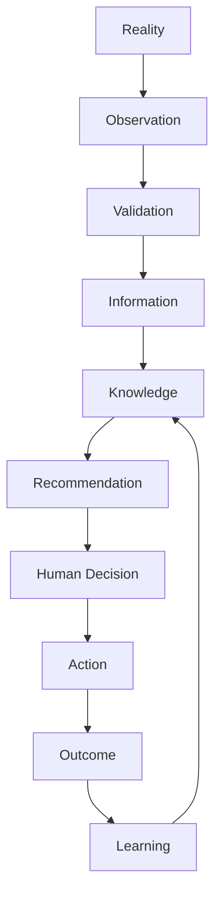
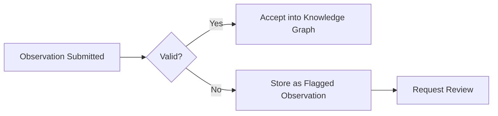
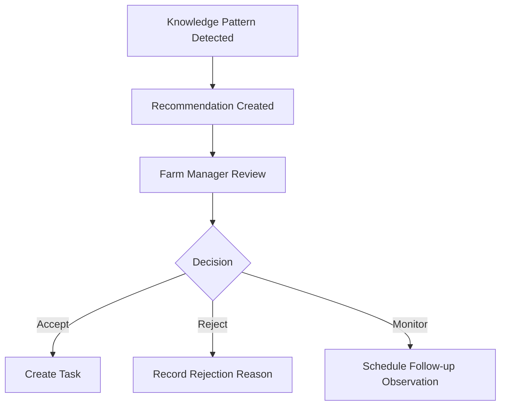
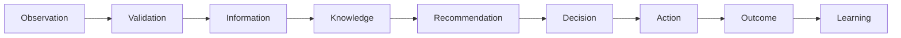

# 4.2 Knowledge Lifecycle Architecture

## 4.2.1 Purpose

The Knowledge Lifecycle Architecture defines how FarmOS transforms reality into observations, observations into knowledge, knowledge into recommendations, recommendations into decisions, and decisions into learning.

Every FarmOS module must comply with this lifecycle.

This applies to:

- animals
- feed
- dairy
- poultry
- veterinary care
- crops
- produce
- inventory
- assets
- finance

## 4.2.2 Lifecycle Overview

The lifecycle is circular. Every outcome improves future knowledge.

## 4.2.3 Stage 0 — Reality

Reality is the true state of the farm before FarmOS observes it.

FarmOS must never assume that missing data means normal status.

Example:

No temperature recorded does not mean normal temperature.

### RULE-KM-201

Unknown information must never be treated as negative information.

## 4.2.4 Stage 1 — Observation

Observation is the atomic unit of knowledge.

An observation is a factual statement recorded at a specific time.

Correct:

- Cow 744 refused feed.
- Cow 744 temperature is 39.6°C.
- Cow 744 milk production is 24.8 L.

Incorrect:

- Cow 744 has mastitis.
- Cow 744 is sick.

### RULE-KM-202

Observations must describe reality, not conclusions.

## 4.2.5 Stage 2 — Validation

Validation determines whether an observation is complete, plausible, and usable.

Validation includes:

- technical validation
- biological validation
- business validation
- duplicate detection

Invalid observations are not deleted. They are stored and flagged.

## 4.2.6 Stage 3 — Information

Information is structured and contextualized observation data.

Example:

Observation:

- Milk = 28 L

Information:

- Average for last 7 days = 31 L
- Difference = -9.7%
- Trend = declining

FarmOS must calculate derived information automatically.

## 4.2.7 Stage 4 — Knowledge

Knowledge is generated by connecting multiple information sources.

Example:

- milk down
- feed intake down
- temperature up
- prior mastitis history

Knowledge:

- animal health may be deteriorating

Knowledge must always reference supporting evidence.

## 4.2.8 Stage 5 — Recommendation

Recommendations suggest action.

Recommendations do not execute action.

A recommendation must contain:

- ID
- related entity
- priority
- confidence
- evidence
- explanation
- suggested action
- due date
- owner
- expected benefit
- risk

## 4.2.9 Stage 6 — Human Decision

FarmOS recommends. Humans decide.

Decision options:

- accept
- reject
- monitor
- delegate
- escalate
- postpone

Every decision must be logged.

## 4.2.10 Stage 7 — Action

Accepted decisions generate actions.

Examples:

- schedule vet visit
- isolate animal
- change feed ration
- repeat observation
- administer approved treatment

Actions create new events and observations.

## 4.2.11 Stage 8 — Outcome

Outcomes measure what happened after an action.

Examples:

- milk recovered
- temperature normalized
- diagnosis confirmed
- recommendation incorrect
- animal deteriorated

Outcome data improves future recommendations.

## 4.2.12 Stage 9 — Learning

Learning evaluates the accuracy and usefulness of recommendations.

Learning occurs at four levels:

1. individual animal
2. species or group
3. Origami Farms
4. future FarmOS platform

## 4.2.13 Traceability

Every recommendation must be traceable:

## 4.2.14 Functional Requirements

### REQ-KM-201

FarmOS shall implement the full knowledge lifecycle from observation to learning.

### REQ-KM-202

FarmOS shall store all recommendations as first-class objects.

### REQ-KM-203

FarmOS shall require every recommendation to reference evidence.

### REQ-KM-204

FarmOS shall record human decisions against recommendations.

### REQ-KM-205

FarmOS shall record outcomes for accepted recommendations.

### REQ-KM-206

FarmOS shall use outcomes to improve future recommendations.

## 4.2.15 Database Entities

Minimum entities:

- observation
- validation_result
- knowledge_object
- recommendation
- recommendation_evidence
- decision
- action
- outcome
- learning_signal

## 4.2.16 API Requirements

Minimum API areas:

- create observation
- list observations
- create recommendation
- review recommendation
- record decision
- record outcome
- query evidence chain

## 4.2.17 UI/UX Requirements

The farm manager must be able to review high-priority recommendations in less than two minutes.

Recommendation cards must show:

- related entity
- priority
- confidence
- reason
- suggested action
- accept / reject / monitor actions

## 4.2.18 Codex Implementation Notes

When implementing the lifecycle:

- Start with data structures before AI.
- Use explicit entities for recommendation, decision, and outcome.
- Do not make recommendation a text-only field.
- Implement traceability before advanced AI.
- Build simple rule-based recommendations first.
- Add model-based intelligence later.

## 4.2.19 Acceptance Criteria

This section is complete when:

- observations can become recommendations
- recommendations reference evidence
- humans can accept/reject/monitor recommendations
- outcomes can be recorded
- the evidence chain can be displayed
- all recommendations are explainable
