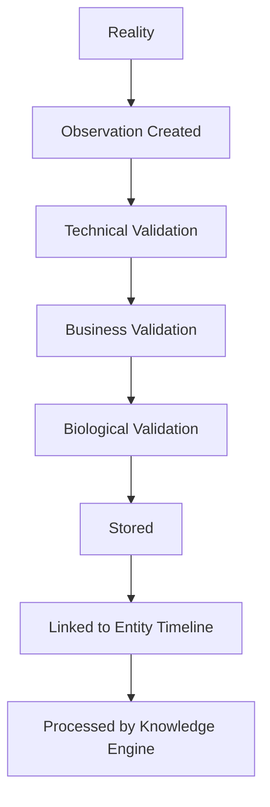
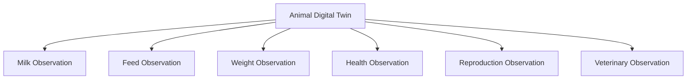
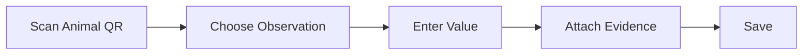

# 4.3 Observation Model Architecture

## 4.3.1 Purpose

The Observation Model defines how FarmOS captures reality.

Observations are the foundation of every intelligent capability in FarmOS.

Every dashboard, recommendation, alert, prediction, report, and AI insight depends on observation quality.

## 4.3.2 Design Philosophy

Workers should record what they observe, not what they believe.

FarmOS should help them capture objective reality quickly and consistently.

The goal is to reduce subjective feedback and create reliable evidence for the farm manager.

## 4.3.3 Definition

An Observation is an immutable factual record about a managed entity at a specific point in time.

Observations must be:

- timestamped
- linked to an entity
- linked to an observer
- classified by type
- validated
- traceable
- available offline

## 4.3.4 Observation Lifecycle



## 4.3.5 Observation Types

### Quantitative Observations

Measured values.

Examples:

- milk volume
- weight
- temperature
- feed intake
- water intake
- egg count

### Qualitative Observations

Structured descriptive observations.

Examples:

- appetite reduced
- walking slowly
- aggressive behavior
- leaves yellowing

### Binary Observations

Yes/no observations.

Examples:

- vaccinated
- isolated
- pregnant
- equipment operational

### Media Observations

Evidence attachments.

Examples:

- photo
- video
- audio
- PDF laboratory report

### Sensor Observations

Automated observations from devices.

Examples:

- milk meter
- smart scale
- weather station
- future IoT devices

## 4.3.6 Observation Quality Levels

| Level | Type | Examples | Confidence |
|---|---|---|---|
| A | Instrument measured | scale, thermometer, milk meter | Highest |
| B | Counted | eggs, feed bags, animals | High |
| C | Human observed | limping, appetite, behavior | Medium |
| D | Opinion | looks sick, seems weak | Low |

FarmOS should guide workers away from Level D observations.

## 4.3.7 Required Metadata

Every observation must include:

- observation_id
- farm_id
- entity_type
- entity_id
- observation_type
- observed_at
- created_at
- observer_id
- source
- value
- unit
- confidence
- verification_status
- location
- attachments
- notes

## 4.3.8 Validation Rules

### Technical Validation

- required fields exist
- valid timestamp
- valid entity
- valid observer
- valid data type

### Biological Validation

- plausible temperature
- plausible milk volume
- plausible weight
- plausible pregnancy duration

### Business Validation

- entity is active
- animal is not sold
- duplicate entry is detected
- observation is allowed for species
- observation matches expected workflow

## 4.3.9 Missing Observations

Missing observations are meaningful.

Examples:

- no milk recorded today
- no feed recorded today
- no health check recorded
- no egg collection recorded

FarmOS should detect missing expected observations and generate reminders.

## 4.3.10 Observation Frequency

| Observation | Default Frequency |
|---|---|
| Milk Production | Every milking |
| Feed Intake | Daily |
| Egg Collection | Daily |
| Temperature | On demand |
| Weight | Weekly or monthly |
| Pregnancy Check | Scheduled |
| Vaccination | Protocol based |

## 4.3.11 Observation Templates

Every observation type should have a structured template.

Example: Health Observation

- animal
- appetite
- locomotion
- temperature
- swelling
- discharge
- severity
- photo
- notes

Templates reduce free text and improve reliability.

## 4.3.12 Observation Relationships



## 4.3.13 Functional Requirements

### REQ-OBS-001

FarmOS shall allow users to create observations offline.

### REQ-OBS-002

FarmOS shall validate observations before knowledge processing.

### REQ-OBS-003

FarmOS shall preserve original observations permanently.

### REQ-OBS-004

FarmOS shall support correction events instead of direct edits.

### REQ-OBS-005

FarmOS shall support media evidence for observations.

### REQ-OBS-006

FarmOS shall detect missing expected observations.

### REQ-OBS-007

FarmOS shall allow administrators to configure observation templates.

## 4.3.14 Database Design

### Table: observation

| Column | Type | Notes |
|---|---|---|
| id | UUID | Primary key |
| farm_id | UUID | Required |
| entity_type | varchar | Animal, Field, Asset, etc. |
| entity_id | UUID | Related entity |
| observation_type_id | UUID | Template/type |
| observer_id | UUID | User or system |
| observed_at | timestamp | Time of real observation |
| created_at | timestamp | Time record was created |
| source | enum | worker, manager, vet, sensor, import |
| value_numeric | decimal | Optional |
| value_text | text | Optional |
| unit | varchar | Optional |
| confidence | decimal | 0–1 |
| verification_status | enum | pending, valid, flagged, rejected |
| notes | text | Optional |

### Table: observation_attachment

| Column | Type | Notes |
|---|---|---|
| id | UUID | Primary key |
| observation_id | UUID | Foreign key |
| media_type | enum | photo, video, audio, pdf |
| file_path | text | Local or cloud path |
| checksum | varchar | Integrity verification |

### Table: observation_template

| Column | Type | Notes |
|---|---|---|
| id | UUID | Primary key |
| name | varchar | Template name |
| entity_type | varchar | Target entity |
| schema_json | jsonb | Field definitions |
| validation_json | jsonb | Rules |
| active | boolean | Is usable |

## 4.3.15 API Specification

### Create Observation

```http
POST /api/v1/observations
```

Example request:

```json
{
  "entityType": "Animal",
  "entityId": "UUID",
  "observationType": "Temperature",
  "value": 39.4,
  "unit": "C",
  "observedAt": "2026-06-30T08:10:00Z",
  "source": "worker"
}
```

### Get Observation

```http
GET /api/v1/observations/{id}
```

### Search Observations

```http
GET /api/v1/observations?entityType=Animal&entityId={id}
```

## 4.3.16 UI/UX Requirements

Observation capture must be fast.

Target:

- standard observation in less than 15 seconds
- no more than 3 taps for common observations
- large touch targets
- offline by default
- minimal typing
- photo attachment optional but easy



## 4.3.17 Codex Implementation Notes

- Start with observation templates.
- Build generic observation entity before animal-specific screens.
- Keep observations immutable.
- Use correction events for changes.
- Support local-first storage.
- Sync observations in background.
- Treat photos as attachments, not embedded database blobs.

## 4.3.18 Acceptance Criteria

This section is complete when:

- observations can be created offline
- observations are immutable
- observations are validated
- observations are linked to timelines
- observations can carry evidence
- missing observations are detected
- observation templates are configurable
- observations can feed the knowledge engine
