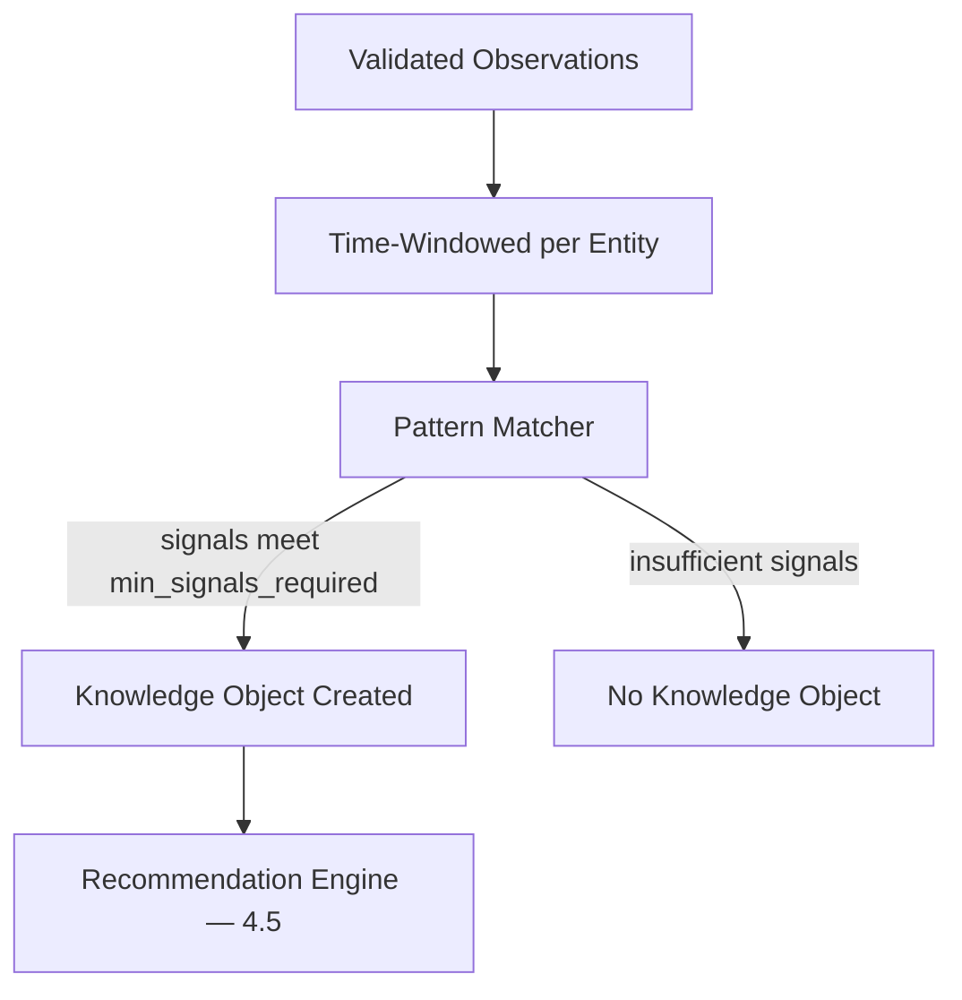

# 4.4 Knowledge Correlation Engine

## 4.4.1 Purpose

The Correlation Engine is the component that turns validated Information (§4.2.6) into Knowledge (§4.2.7) by connecting multiple observations about the same entity, and its history, into a single explainable pattern.

It is the boundary between "storing data" and "understanding the farm."

## 4.4.2 What Correlation Means

Correlation does not mean machine learning in the MVP. It means applying explicit, testable rules that connect related information:

> Milk down 18% + feed intake down 12% + temperature elevated + prior mastitis history → health risk pattern detected.

Each of these four facts, alone, is unremarkable. Together, within a time window and scoped to one entity, they form a Knowledge Object.

### RULE-KM-401 — Correlation Requires Multiple Independent Signals

A Knowledge Object SHALL NOT be generated from a single observation alone, except where a single observation is itself unambiguous and actionable (e.g., "temperature = 41°C" independently crosses a critical biological threshold).

### RULE-KM-402 — Correlation Is Scoped

Correlation rules operate within a bounded scope: one entity (or its group), a defined time window, and a defined observation set. Cross-farm or cross-species correlation is out of scope for the MVP.

## 4.4.3 Correlation Pattern Structure

Every correlation pattern is defined declaratively, not hard-coded per animal:

```json
{
  "pattern_id": "health-decline-v1",
  "applies_to": ["Animal:Cow", "Animal:Goat"],
  "window_days": 3,
  "signals": [
    { "metric": "milk_yield", "trend": "decline", "threshold_pct": -10 },
    { "metric": "feed_intake", "trend": "decline", "threshold_pct": -10 },
    { "metric": "temperature", "trend": "above_normal" },
    { "metric": "health_history", "condition": "prior_mastitis" }
  ],
  "min_signals_required": 2,
  "confidence_weights": { "milk_yield": 0.3, "feed_intake": 0.2, "temperature": 0.3, "health_history": 0.2 },
  "produces": "recommendation:veterinary-review"
}
```

## 4.4.4 Correlation Flow



## 4.4.5 Confidence Weighting by Observation Quality

Per the Observation Quality Levels (§4.3.6), a signal contributed by a Level A observation (instrument measured) carries more weight than the same signal from a Level D observation (opinion).

### RULE-KM-403 — Confidence Reflects Observation Quality

The Correlation Engine SHALL weight each contributing signal by the confidence of its underlying observation(s), and SHALL propagate a combined confidence score to the resulting Knowledge Object. Level D observations may contribute to a pattern but SHALL NOT, alone, raise a Knowledge Object to "High" confidence.

## 4.4.6 Missing Data Handling

Per Constitution Principle "Reality Before Software" and RULE-KM-201 (§4.2.3), a missing signal is neither true nor false — it is unknown. The Correlation Engine treats missing signals as reducing available evidence, not as evidence of normalcy.

## 4.4.7 Knowledge Object Structure

| Field | Purpose |
|---|---|
| id | Unique identifier |
| entity_type / entity_id | What the knowledge is about |
| pattern_id | Which correlation pattern fired |
| supporting_observation_ids | Full evidence trail |
| confidence | Combined, weighted score (0-1) |
| detected_at | When the pattern was matched |
| status | active, resolved, superseded |

## 4.4.8 Functional Requirements

### REQ-KM-401
The Correlation Engine shall evaluate patterns against newly validated observations as they arrive (event-driven), not only on a fixed batch schedule.

### REQ-KM-402
Every Knowledge Object shall store the exact set of observation IDs that produced it.

### REQ-KM-403
Correlation patterns shall be stored as versioned, editable configuration, not compiled into application code.

### REQ-KM-404
The engine shall support per-species and per-entity-group pattern scoping (Constitution Principle 16 — Mixed Farm by Design).

## 4.4.9 Codex Implementation Notes

- Implement patterns as data (JSON/YAML rule definitions), evaluated by a generic rule evaluator — do not hand-code "if milk down and temp up" logic per species.
- Start with a small library of MVP patterns (health decline, production decline, feed inefficiency, inventory shortfall) rather than trying to cover every possible correlation upfront.
- Log every pattern evaluation (matched or not) at debug level during the pilot phase (Phase 7) to help tune thresholds.
- Advanced ML-based correlation is explicitly a post-MVP concern (see [4.10 AI Governance](04.10-AI-Governance.md)); the rule-based engine must work completely on its own first.

## 4.4.10 Acceptance Criteria

This section is complete when:

- Knowledge Objects are only created from declaratively defined patterns.
- Every Knowledge Object can be traced back to its exact supporting observations.
- Confidence scores visibly reflect observation quality, not just signal count.
- Missing data never silently strengthens a pattern's confidence.
