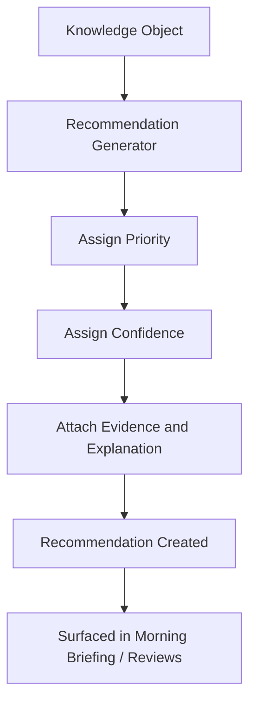

# 4.5 Recommendation Engine

## 4.5.1 Purpose

The Recommendation Engine converts a Knowledge Object (§4.4.7) into a concrete, actionable suggestion for a human — the Recommendation stage of the Knowledge Lifecycle (§4.2.8).

A Recommendation is a suggestion. It is never an instruction the system carries out on its own (Constitution Principle 7 — Human Decision Authority).

## 4.5.2 Recommendation Categories

| Category | Example |
|---|---|
| Health | Schedule veterinary examination for Cow 744 |
| Production | Review feed ration for Flock B — egg production declining |
| Inventory | Feed stock will run out in 4 days — reorder soon |
| Financial | Product X margin has dropped below cost threshold |
| Breeding | Cow 812 is due for breeding window |
| Compliance | Withdrawal period active — do not sell milk from Cow 744 |

## 4.5.3 Recommendation Object Structure

Every Recommendation, regardless of category, must contain (Constitution Principle 6 — Evidence Before Opinion):

| Field | Required | Purpose |
|---|---|---|
| id | Yes | Unique identifier |
| entity_type / entity_id | Yes | Subject of the recommendation |
| category | Yes | Health, Production, Inventory, Financial, Breeding, Compliance |
| priority | Yes | Urgent, High, Medium, Low |
| confidence | Yes | High, Medium, Low (derived from §4.4.5) |
| evidence | Yes | Supporting observation and knowledge object IDs |
| explanation | Yes | Human-readable reasoning (see [4.7 Explainable AI](04.7-Explainable-AI.md)) |
| suggested_action | Yes | What the manager could do |
| missing_information | No | What would raise confidence |
| due_date | No | When action should be taken by |
| status | Yes | Open, Accepted, Rejected, Monitoring, Closed (see §3.3.3) |

## 4.5.4 Generation Flow

## 4.5.5 Priority Assignment

Priority is derived, not manually set, from the severity of the underlying pattern and the entity's history:

### RULE-KM-501 — Priority Reflects Risk and Recency

Priority SHALL be computed from (a) the biological or financial severity implied by the pattern, and (b) how recently and consistently the supporting signals were observed. A single old, unconfirmed signal SHALL NOT produce an Urgent recommendation.

## 4.5.6 MVP Approach: Rule-Based, Not Machine-Learned

### RULE-KM-502 — Rule-Based First

The MVP Recommendation Engine SHALL be implemented as deterministic, testable rules mapping Knowledge Object patterns to recommendations. Statistical or machine-learned recommendation generation is explicitly out of scope until the rule-based engine has been validated through real use at Origami Farms (Phase 6-7, see [product/ROADMAP.md](../../product/ROADMAP.md)).

This keeps every recommendation auditable and explainable from day one, satisfying Constitution Principle 8 (Explainable Intelligence) without depending on model interpretability research.

## 4.5.7 Prohibited Behaviors

Per Constitution Principle 17 and concept note §4.8, the Recommendation Engine SHALL NOT:

- State a diagnosis as fact (it may reference a *pattern*, e.g. "signs consistent with mastitis," never "Cow 744 has mastitis").
- Prescribe a specific medicine or dose.
- Automatically create, execute, or close an Action without a human Decision.
- Suppress or hide a low-confidence recommendation instead of showing it with its confidence clearly marked.

## 4.5.8 Functional Requirements

### REQ-KM-501
The engine shall generate a Recommendation only when at least one Knowledge Object supports it.

### REQ-KM-502
Every Recommendation shall be queryable back to its full evidence chain (Observation → Validation → Information → Knowledge → Recommendation).

### REQ-KM-503
The engine shall support recommendation categories independently versioned from correlation patterns, so a single Knowledge Object type could in principle produce different recommendations as rules evolve.

### REQ-KM-504
Recommendations shall never be deleted; rejected or superseded recommendations are retained with their final status.

## 4.5.9 UI/UX Requirements

Recommendation cards, wherever shown (Morning Briefing, Daily/Weekly/Monthly Reviews — [4.6](04.6-Decision-Intelligence.md)), must let the farm manager review and act in under two minutes per item:

- entity name/photo
- priority and confidence badges
- one-line explanation
- accept / reject / monitor actions visible without scrolling
- link to full evidence chain for anyone who wants to dig deeper

## 4.5.10 Codex Implementation Notes

- Implement recommendation generation as a pure function of Knowledge Objects plus rule configuration — no side effects, fully unit-testable.
- Keep the evidence chain as foreign keys/IDs, never as duplicated copies of the underlying observation values.
- Reject any implementation where "confidence" is a free-text field instead of a computed, explainable score.

## 4.5.11 Acceptance Criteria

This section is complete when:

- Every recommendation in the system carries evidence, confidence, and a suggested action.
- No recommendation states a diagnosis or prescribes medication.
- A manager can trace any recommendation back to the exact observations that produced it.
- Rejected recommendations remain visible in history rather than disappearing.
