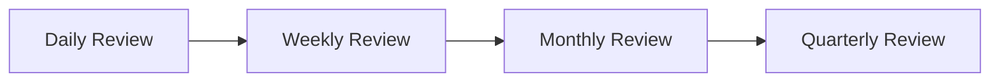

# 4.6 Decision Intelligence

## 4.6.1 Purpose

Decision Intelligence defines how humans act on Recommendations (§4.5), how those decisions are logged, and how FarmOS organizes recommendations into periodic reviews so the farm manager is never facing an unstructured firehose of alerts.

## 4.6.2 Decision Options

Per concept note §8.7 and the Recommendation Lifecycle (§3.3.3), every open Recommendation resolves to one of:

| Decision | Meaning |
|---|---|
| Accept | Manager agrees; an Action is created |
| Reject | Manager disagrees; a rejection reason is recorded |
| Monitor | Not urgent yet; re-evaluate when new evidence arrives |
| Delegate | Assigned to another user (e.g., a worker or the veterinarian) |
| Escalate | Raised to a higher-authority role (e.g., Owner) |
| Postpone | Deferred to a specific later date |

### RULE-KM-601 — Every Decision Is Logged

FarmOS SHALL record who made the decision, when, which option was chosen, and any reason given. Decisions are never inferred from silence.

## 4.6.3 Decision Object Structure

| Field | Purpose |
|---|---|
| id | Unique identifier |
| recommendation_id | The recommendation being resolved |
| decided_by | User ID |
| decision | accept / reject / monitor / delegate / escalate / postpone |
| reason | Optional free text, required for reject |
| decided_at | Timestamp |
| delegated_to / escalated_to | User ID, when applicable |
| postponed_until | Date, when applicable |

## 4.6.4 Periodic Reviews

Rather than a flat, ever-growing alert list, FarmOS organizes Decision Intelligence into four review cadences (concept note §19):

### 4.6.4.1 Daily Review — "What needs attention today?"

Surfaces Urgent/High priority open recommendations: production drops, feed stock below threshold, egg decline, vaccination due, active withdrawal periods, harvest due. This is the primary content of the Morning Briefing (§3.4).

### 4.6.4.2 Weekly Review — "What trends are emerging?"

Aggregates the week's Knowledge Objects and outcomes: milk trend, egg trend, feed efficiency, repeated health issues, inventory consumption, sales performance.

### 4.6.4.3 Monthly Review — "What management decisions are needed?"

Surfaces slower-moving, higher-stakes recommendations: low-performing animals, high-cost feed, veterinary expense trends, product/crop profitability, supplier performance.

### 4.6.4.4 Quarterly Review — "What strategic changes are needed?"

Surfaces strategic-level recommendations: breeding strategy, cull candidates, feed sourcing, crop planning, investment priorities, commercial readiness (see [product/ROADMAP.md](../../product/ROADMAP.md)).

### RULE-KM-602 — Reviews Are Views, Not New Data

Daily/Weekly/Monthly/Quarterly Reviews SHALL be filtered, aggregated views over the same underlying Recommendation and Knowledge Object data — not separate parallel data models. A recommendation generated today can appear in the Daily Review and later be referenced in the Monthly Review's trend analysis.

## 4.6.5 Functional Requirements

### REQ-KM-601
FarmOS shall record a Decision for every Recommendation a user resolves, using one of the six options in §4.6.2.

### REQ-KM-602
FarmOS shall generate Daily, Weekly, Monthly, and Quarterly review views from the same Recommendation/Knowledge Object store, scoped by time window and priority.

### REQ-KM-603
FarmOS shall support delegation and escalation with a visible owner for every open recommendation.

### REQ-KM-604
Postponed recommendations shall automatically resurface on or after their postponed_until date.

## 4.6.6 UI/UX Requirements

- The Daily Review is reachable in one tap from the Morning Briefing.
- Weekly/Monthly/Quarterly reviews are reachable from a single "Reviews" entry point, not scattered across unrelated menus.
- Every review groups items by priority first, category second.

## 4.6.7 Codex Implementation Notes

- Build the review cadences as query/aggregation logic over Recommendation and Knowledge Object tables, not as materialized separate tables that can drift out of sync.
- Implement postponement as a scheduled re-surfacing query, not a background job that mutates recommendation state silently.
- Keep decision-logging on the same transaction as the recommendation status change to avoid orphaned "Accepted" recommendations with no logged Decision.

## 4.6.8 Acceptance Criteria

This section is complete when:

- Every resolved recommendation has exactly one logged Decision.
- The four review cadences can be demonstrated pulling from the same underlying data.
- A postponed recommendation reliably resurfaces on its target date.
- Delegated and escalated recommendations show a clear current owner.
