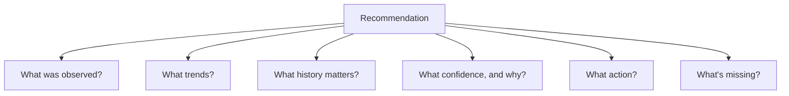

# 4.7 Explainable AI

## 4.7.1 Purpose

This section defines the explanation contract every FarmOS recommendation must satisfy, regardless of whether it was produced by a simple rule (MVP) or, in later phases, a statistical model. Explainability is not a UI nicety — it is Constitution Principle 8, and it is the mechanism by which FarmOS earns trust (Risk 4, concept note §21).

## 4.7.2 The Explanation Contract

### RULE-KM-701 — Six Questions Every Recommendation Must Answer

Every Recommendation SHALL be able to answer, on demand:

1. **What was observed?** — the raw observations behind it.
2. **Which trends were detected?** — the derived information (§4.2.6).
3. **What historical context matters?** — prior related events (e.g., mastitis history).
4. **What confidence level is assigned, and why?** — see §4.7.3.
5. **What action is suggested?**
6. **What information is missing that would improve confidence?**

A recommendation that cannot answer all six SHALL NOT be shown to a user.

## 4.7.3 Confidence Scoring

Confidence is presented to the user as one of three bands — **High / Medium / Low** — backed by a numeric score computed in the Correlation Engine (§4.4.5) and Recommendation Engine (§4.5.5):

| Band | Numeric range | Typical basis |
|---|---|---|
| High | ≥ 0.75 | Multiple Level A/B signals agree, consistent over the time window |
| Medium | 0.4 - 0.74 | Mixed signal quality, or fewer independent signals |
| Low | < 0.4 | Mostly Level C/D signals, or a single weak signal |

### RULE-KM-702 — Confidence Is Never Hidden or Faked

FarmOS SHALL NOT display a recommendation without its confidence band, and SHALL NOT inflate confidence to make a recommendation appear more actionable than its evidence supports.

## 4.7.4 Explanation Rendering

Example explanation card:

> **Schedule veterinary examination for Cow 744 today.**
> Confidence: **High**
> Because: milk production dropped 18% over 3 days, feed intake dropped 12%, temperature elevated to 39.6°C, and Cow 744 has a prior mastitis history (March 2026).
> Missing: no udder-swelling observation recorded yet — adding one would raise confidence further.

## 4.7.5 No Black Boxes

### RULE-KM-703 — Black-Box Recommendations Are Prohibited

If a future model (post-MVP, see [4.10 AI Governance](04.10-AI-Governance.md)) cannot produce a human-readable explanation satisfying §4.7.2, it SHALL NOT be used to generate farm-facing recommendations, regardless of its predictive accuracy.

## 4.7.6 Functional Requirements

### REQ-KM-701
FarmOS shall store, for every Recommendation, the specific evidence, confidence score, and missing-information notes needed to render the explanation contract in §4.7.2.

### REQ-KM-702
FarmOS shall render confidence as both a qualitative band and, on request, the underlying reasoning — never confidence alone without evidence.

### REQ-KM-703
FarmOS shall allow a manager to open the full evidence chain (Observation → Validation → Information → Knowledge → Recommendation) from any recommendation card.

## 4.7.7 UI/UX Requirements

- Confidence bands use consistent color coding across the entire app (e.g., green/amber/red), never ad hoc per screen.
- The "why" explanation is one tap away from every recommendation, not buried in a settings or admin view.
- Missing-information notes are phrased as an action a worker could take ("Record udder swelling observation"), not as a system limitation.

## 4.7.8 Codex Implementation Notes

- Generate explanation text from structured evidence data (templated), not by concatenating raw database fields — the explanation must read naturally to a non-technical farm manager.
- Do not implement confidence as a single opaque float shown to users; always translate to High/Medium/Low with the underlying reasoning available.
- When introducing any statistical or ML component later, require it to emit the same evidence/explanation structure as the rule-based engine — this contract does not change based on implementation technique.

## 4.7.9 Acceptance Criteria

This section is complete when:

- Every recommendation in the system can answer all six questions in §4.7.2 without engineering involvement.
- Confidence bands are visually consistent and always paired with an explanation.
- No recommendation ships that cannot be explained in plain language to a farm manager.
