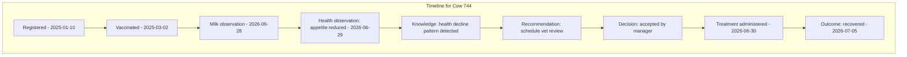

# 4.8 Knowledge Timeline

## 4.8.1 Purpose

The Knowledge Timeline is the unified, chronological view of everything FarmOS knows about one entity — the concrete implementation of the "Five-Minute Test" (Ontology §2.6): *if this animal disappeared tomorrow, could another farm manager understand its life in under five minutes?*

Without a timeline, event-driven history (Constitution Principle 4) is architecturally correct but practically unusable — nobody can read a raw event log under time pressure in a barn. The timeline is the human-readable projection of that event log.

## 4.8.2 What Appears on a Timeline

For a given entity (Animal, Flock, Field, or other digital twin), the timeline merges, in chronological order:

- Registration and identity events
- Observations (§4.3)
- Knowledge Objects detected (§4.4)
- Recommendations generated and their resolution (§4.5, §4.6)
- Treatments, vaccinations, and withdrawal periods ([Chapter 9](../09-Veterinary/09-Veterinary-Management.md))
- Production events (milking, egg collection, harvest)
- Feed distribution events
- Breeding and reproduction events
- Sales, transfers, and financial events tied to the entity
- Photos and other media attachments

## 4.8.3 Timeline Is a Read Projection, Not a Separate Store

### RULE-KM-801 — Timeline Is Derived

The timeline SHALL be a read-time (or materialized, cache-refreshed) projection over existing event, observation, knowledge, recommendation, decision, and outcome records. It SHALL NOT be maintained as an independently editable table that could drift from the source records.

## 4.8.4 Filtering and Density

A cow with two years of history can accumulate thousands of entries. The timeline must remain useful under time pressure:

### RULE-KM-802 — Default to Signal, Not Noise

By default, the timeline SHALL show a curated view (recent activity, open recommendations, key milestones) with the option to expand to full raw history. It SHALL NOT force the user to scroll through routine daily observations to find what matters.

Filters must include at minimum: category (health, production, feed, financial, breeding), date range, and "flagged/important only."

## 4.8.5 Functional Requirements

### REQ-KM-801
FarmOS shall provide a single timeline view per digital twin entity, combining all record types listed in §4.8.2.

### REQ-KM-802
The timeline shall load a default curated view in under two seconds on a mid-range Android tablet, even for entities with multi-year history.

### REQ-KM-803
The timeline shall support drill-down from any entry to its full record (e.g., from a recommendation entry to its full evidence chain per §4.7.9).

### REQ-KM-804
The timeline shall be available offline for any entity already synced to the local device.

## 4.8.6 UI/UX Requirements

- Timeline entries use icons and color coding consistent with the rest of the app (see [Chapter 13 — UI/UX Design System](../13-UI-UX-Design-System/13-UI-UX-Design-System.md)).
- The timeline is reachable directly from the entity's profile screen (Animal, Flock, Field) with no more than one tap.
- Correction events (§3.2) are shown alongside the original entry they correct, not hidden.

## 4.8.7 Codex Implementation Notes

- Implement the timeline as a query that unions the relevant tables ordered by timestamp, with pagination and category filters — avoid a bespoke "timeline_entry" table that must be kept in sync manually.
- Cache/paginate aggressively for offline performance; do not attempt to load an entity's entire history into memory on every profile view.
- Reuse the same timeline component across Animal, Flock, and Field profiles rather than building per-entity-type timeline UIs.

## 4.8.8 Acceptance Criteria

This section is complete when:

- Any Animal, Flock, or Field profile can show its full history as a single chronological timeline.
- The Five-Minute Test (Ontology §2.6) can be demonstrated: an unfamiliar manager can understand an animal's current status and recent history within five minutes using only the timeline.
- The timeline works fully offline for previously synced entities.
