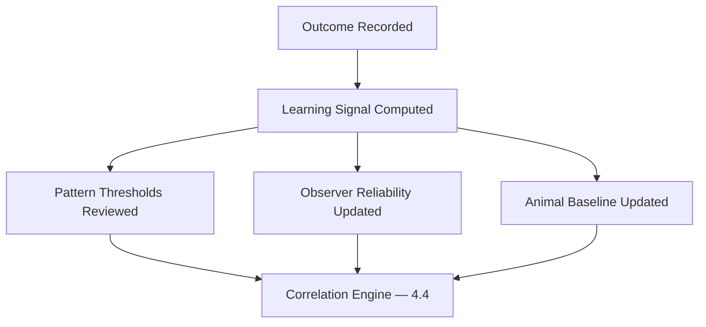

# 4.9 Knowledge Feedback Loop

## 4.9.1 Purpose

The Feedback Loop closes the Knowledge Lifecycle: Outcomes (§4.2.11) feed back into Learning (§4.2.12), which improves future Knowledge Objects and Recommendations. Without this loop, FarmOS would generate the same quality of recommendation on day 1000 as on day 1, despite Constitution Principle 14 (Continuous Learning).

## 4.9.2 Outcome Capture

### RULE-KM-901 — Every Accepted Recommendation Requires an Outcome

When a Recommendation is Accepted and its Action completed, FarmOS SHALL prompt for an Outcome (§4.2.11: recovered, normalized, confirmed, no issue found, incorrect, deteriorated). Outcomes are not optional metadata — they are the raw material of learning.

### RULE-KM-902 — Rejected Recommendations Also Produce Signal

A Rejected recommendation with a logged reason (§4.6.3) is itself a learning signal: it may indicate the correlation pattern is too sensitive, or that context the system lacked was available to the manager.

## 4.9.3 Learning Signal Types

| Signal | Derived from | Used for |
|---|---|---|
| Recommendation accuracy | Outcome vs. original recommendation | Tuning correlation pattern thresholds (§4.4.3) |
| Observer reliability | Correlation between an observer's Level C/D observations and confirmed outcomes | Weighting future observations from that user |
| Animal-specific baseline | Historical normal range per animal | Reducing false positives for naturally variable animals |
| Pattern false-positive rate | Rejected recommendations per pattern | Flagging patterns for review before Phase 6 (Intelligence and Reports) |

## 4.9.4 Feedback Flow

## 4.9.5 Learning Is Reviewed by Humans, Not Auto-Applied Blindly

### RULE-KM-903 — No Silent Rule Rewriting

FarmOS SHALL NOT automatically rewrite correlation pattern thresholds or recommendation rules based on learning signals without human review and approval, at least through the MVP and pilot phases (Phase 6-7). Learning signals inform a periodic tuning review; they do not silently mutate production behavior overnight.

This keeps the system auditable (Constitution Principle 15 — Traceability) and prevents a bad batch of outcomes from silently degrading recommendation quality.

## 4.9.6 Knowledge Maturity Index

As a forward-looking metric (concept note §18, future reports), FarmOS tracks a **Knowledge Maturity Index** per pattern/category: the ratio of recommendations with recorded outcomes to total recommendations, and the recommendation accuracy rate within that category. This index indicates how much a given category's rules can be trusted and is a leading indicator for readiness to introduce more advanced, model-based correlation (see [4.10 AI Governance](04.10-AI-Governance.md)).

## 4.9.7 Functional Requirements

### REQ-KM-901
FarmOS shall prompt for and store an Outcome against every Accepted recommendation's resulting Action.

### REQ-KM-902
FarmOS shall compute recommendation accuracy per correlation pattern, using recorded outcomes.

### REQ-KM-903
FarmOS shall compute an observer reliability signal without exposing it as a punitive or public score to workers — it is an internal tuning input, not a performance review tool.

### REQ-KM-904
FarmOS shall surface pattern-level accuracy and false-positive rates to the Farm Manager/Owner as part of periodic reviews (§4.6.4).

## 4.9.8 Codex Implementation Notes

- Store outcomes as first-class records linked to Actions, not as a free-text field on the Recommendation.
- Compute learning signals as scheduled aggregation jobs, not inline on every request — they are used for periodic tuning, not real-time scoring.
- Keep observer reliability internal to the knowledge engine; do not surface it as a worker-facing "trust score" without a deliberate product decision, since it risks discouraging honest low-confidence (Level C/D) reporting.

## 4.9.9 Acceptance Criteria

This section is complete when:

- Outcomes are captured for accepted recommendations and are queryable per pattern.
- A recommendation accuracy rate can be computed per correlation pattern.
- No correlation pattern or recommendation rule changes in production without a human-reviewed tuning step.
- The Knowledge Maturity Index can be computed from stored data.
