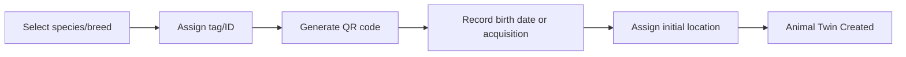

# Chapter 5 — Animal Digital Twin

## 5.1 Purpose

The Animal Digital Twin is the heart of FarmOS (concept note §10). This chapter specifies the concrete data and behavior for the `Animal` entity introduced in [Ontology §2.3.3](../02-Ontology.md#233-animal), covering cows, sheep, goats, and horses under one model (Constitution Principle 16 — Mixed Farm by Design).

## 5.2 Twin Contents

Every Animal digital twin carries:

| Group | Fields |
|---|---|
| Identity | ID, tag number, name (optional), species, breed, sex, birth date/estimated age, QR code |
| Location | Current location, location history |
| Health state | Derived from latest observations/treatments (§3.3.1 Animal Lifecycle) |
| Production history | Milk yield history (if applicable), weight history |
| Feed history | Feed distributions received (see [Chapter 6](../06-Feed/06-Feed-Management.md)) |
| Medical history | Observations, treatments, vaccinations, withdrawal periods (see [Chapter 9](../09-Veterinary/09-Veterinary-Management.md)) |
| Breeding history | Heat/service/pregnancy/birth events |
| Financial history | Acquisition cost, feed cost allocation, vet cost allocation, sale value |
| Media | Photos |
| Timeline | Unified view per [4.8 Knowledge Timeline](../04-Knowledge-Model/04.8-Knowledge-Timeline.md) |
| Recommendations | Open and historical recommendations concerning this animal |

## 5.3 The Five-Minute Test

Per [Ontology §2.6](../02-Ontology.md#26-the-five-minute-test), the Animal profile screen must let an unfamiliar farm manager understand the animal's current status and history within five minutes, using the Timeline as the primary surface.

## 5.4 Animal Registration

Registration is the first event in an Animal's lifecycle (§3.3.1):



### RULE-ADT-101 — Registration Is Irreversible Identity

Once an Animal is registered, its ID SHALL NOT be reassigned to a different physical animal, even after sale or death, per Constitution Principle 3 (Digital Twin).

## 5.5 Animal Lookup

Per concept note §7 (priority workflow: Animal lookup and profile) and Constitution Principle 11 (Tablet First):

### REQ-ADT-101
FarmOS shall support animal lookup via QR code scan, tag number entry, and name/text search, all functioning fully offline for previously synced animals.

## 5.6 Breeding and Reproduction

Breeding events (heat detected, service/insemination, pregnancy confirmed, birth recorded) are captured as events per §3.2, feeding the Animal Lifecycle state machine (§3.3.1). Breeding readiness (concept note §3: "which cows, goats, or sheep are ready for breeding?") is a Recommendation category derived from breeding history and species-specific cycles (see [4.5 Recommendation Engine](../04-Knowledge-Model/04.5-Recommendation-Engine.md)).

## 5.7 Weight and Growth Tracking

Weight observations (Level A if measured on a scale, Level C if estimated) build a growth curve per animal, used for feed ration planning ([Chapter 6](../06-Feed/06-Feed-Management.md)) and health monitoring (unexpected weight loss as a correlation signal, [4.4](../04-Knowledge-Model/04.4-Knowledge-Correlation-Engine.md)).

## 5.8 Profitability

Per concept note §3 ("which animals are profitable and which are not?"), each Animal's financial history aggregates acquisition cost, allocated feed cost, allocated veterinary cost, and production/sale revenue into a per-animal profitability view. This view is MVP-Light — full cost allocation modeling is refined in [Chapter 12 — Sales and Finance](../12-Sales-Finance/12-Sales-and-Finance.md).

## 5.9 Database Entities

| Entity | Key fields |
|---|---|
| animal | id, farm_id, tag_number, species, breed, sex, birth_date, status, current_location_id |
| animal_location_history | animal_id, location_id, moved_at |
| animal_weight | animal_id, value_kg, observed_at, observation_id |
| breeding_event | animal_id, event_type (heat/service/pregnancy_confirmed/birth), event_date, notes |
| animal_photo | animal_id, file_path, taken_at |

Full physical schema (types, indices, constraints) is specified in [Chapter 14 — Database Architecture](../14-Database-Architecture/14-Database-Architecture.md).

## 5.10 API Sketch

```
GET  /api/v1/animals?location_id=&species=&status=
GET  /api/v1/animals/{id}
GET  /api/v1/animals/{id}/timeline
POST /api/v1/animals
POST /api/v1/animals/{id}/breeding-events
POST /api/v1/animals/{id}/weight
```

## 5.11 UI/UX Requirements

- Animal profile opens with: photo, identity, current status badge, and top 3 open recommendations, before any historical detail.
- QR scan is the default lookup entry point; text search is the fallback.
- One-hand quick actions (Feed, Milk, Observe, Treat, Move) are reachable directly from the profile without navigating away.

## 5.12 Functional Requirements

### REQ-ADT-102
FarmOS shall generate a scannable QR code for every registered Animal.
### REQ-ADT-103
FarmOS shall never hard-delete an Animal record; sold or deceased animals move to a terminal lifecycle state (§3.3.1) and remain queryable.
### REQ-ADT-104
FarmOS shall surface breeding-readiness recommendations based on species-specific cycle data and breeding history.

## 5.13 Codex Implementation Notes

- Build one `Animal` table with a `species` discriminator column; do not create `cow`, `sheep`, `goat`, `horse` tables.
- Location history is append-only; current location is the latest entry, not a separately maintained field that can drift.
- Reuse the generic Observation, Timeline, and Recommendation components from Chapter 4 rather than building animal-specific equivalents.

## 5.14 Acceptance Criteria

This chapter is satisfied when:

- A worker can register a new animal of any supported species using the same screen flow.
- The Five-Minute Test (§5.3) passes for a sample animal with realistic history.
- Breeding-readiness recommendations appear for at least one qualifying animal in test data.
