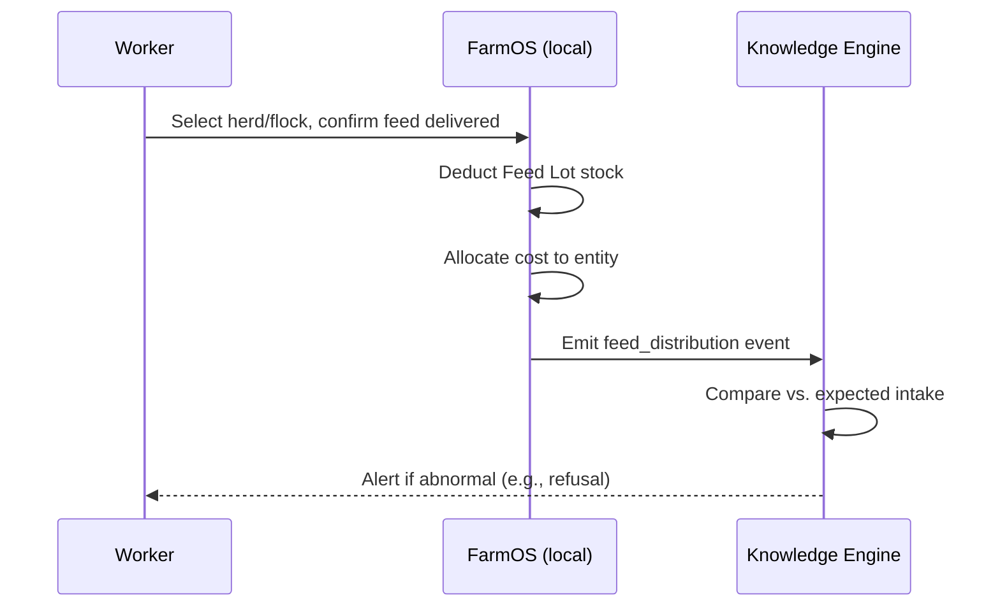

# Chapter 6 — Feed Management

## 6.1 Purpose

Feed is the highest-frequency, highest-cost recurring activity on the farm and the input side of every production and profitability question (concept note §3: "how much feed was consumed today? how many days of feed inventory remain?"). This chapter specifies Feed Item, Feed Lot, and the Feeding Workflow (concept note §12.2).

## 6.2 Entities

- **Feed Item** — a type of feed (e.g., "layer mash," "alfalfa hay"), per [Ontology §2.3.7](../02-Ontology.md#237-feed-item--feed-lot).
- **Feed Lot** — a specific purchased or produced batch of a Feed Item with quantity, unit cost, and remaining stock.
- **Feed Distribution** — the event of feed being given to an Animal, Herd, or Flock, drawing down a Feed Lot.
- **Ration** — a planned feed allocation for a Herd/Flock/Animal, used as the default suggestion in the feeding workflow.

## 6.3 Feeding Workflow

Per concept note §12.2, the worker:

1. Selects barn, herd, flock, or animal.
2. Views the planned ration.
3. Confirms feed delivered.
4. Adjusts quantity if needed.
5. Records leftovers or refusals.
6. Saves offline.

FarmOS then, from that single event:

7. Deducts inventory from the relevant Feed Lot automatically.
8. Allocates feed cost to the Animal/Herd/Flock.
9. Updates the Animal or Flock timeline (§4.8).
10. Triggers alerts for abnormal intake (fed into the Correlation Engine, §4.4).



### RULE-FEED-101 — Feeding Always Deducts a Specific Lot

A Feed Distribution SHALL reference the specific Feed Lot it draws from (FIFO by default), never an abstract "feed type" with no traceable batch, so that feed cost and, if ever needed, feed-quality recalls are traceable.

## 6.4 Feed Inventory

### REQ-FEED-101
FarmOS shall track remaining stock per Feed Lot, computed from purchase/production quantity minus all Feed Distribution events drawing from it — a derived value, never a manually edited stock field (§3.2).

### REQ-FEED-102
FarmOS shall forecast days-of-inventory-remaining per Feed Item, using recent consumption rate, and generate a Recommendation (Inventory category, §4.5.2) when projected to run out within a configurable threshold (default 7 days).

## 6.5 Feed-to-Production Correlation

Feed intake is one of the most common correlation signals across FarmOS (§4.4.3): reduced intake combined with other signals (temperature, milk drop) raises a health-risk pattern; reduced intake alone over multiple days without other signals raises a feed-refusal recommendation on its own.

## 6.6 Database Entities

| Entity | Key fields |
|---|---|
| feed_item | id, farm_id, name, unit, species_applicability |
| feed_lot | id, feed_item_id, source (purchase/production), quantity_received, unit_cost, received_at |
| feed_distribution | id, feed_lot_id, entity_type, entity_id, quantity, distributed_at, recorded_by |
| ration | id, entity_type, entity_id, feed_item_id, planned_quantity, effective_from |

## 6.7 API Sketch

```
GET  /api/v1/feed-items
GET  /api/v1/feed-lots?feed_item_id=
POST /api/v1/feed-lots                    # record a purchase/production batch
POST /api/v1/feed-distributions           # the core feeding workflow action
GET  /api/v1/feed-items/{id}/forecast     # days-of-inventory-remaining
```

## 6.8 UI/UX Requirements

- The feeding screen defaults to the planned ration; confirming requires one tap when no adjustment is needed (Constitution Principle 12 — Simplicity Over Complexity).
- Leftover/refusal recording uses a simple quantity or percentage input, not free text, to keep it a structured Observation (§4.3.11 templates).
- Feed stock warnings appear on the Morning Briefing (§3.4), not only in a separate inventory report.

## 6.9 Functional Requirements

### REQ-FEED-103
FarmOS shall allow feed distribution recording fully offline, deducting from a locally cached Feed Lot balance and reconciling on sync (see [Chapter 16 — Offline Synchronization](../16-Offline-Synchronization/16-Offline-Synchronization.md)).

### REQ-FEED-104
FarmOS shall allocate feed cost per distribution event to the receiving Animal/Herd/Flock for profitability views (§5.8, [Chapter 12](../12-Sales-Finance/12-Sales-and-Finance.md)).

## 6.10 Codex Implementation Notes

- Model Feed Lot depletion as a computed aggregate (sum of distributions), not a mutable `current_stock` field updated in place — this keeps it consistent with the event-driven behavioral model (§3.2).
- Implement the forecast (§6.4 REQ-FEED-102) as a simple moving-average consumption rate for MVP; do not over-engineer with predictive modeling before Phase 6.
- Reuse the generic Observation infrastructure for "abnormal intake" alerts rather than building feed-specific alerting logic outside the Knowledge Model.

## 6.11 Acceptance Criteria

This chapter is satisfied when:

- A worker can complete a standard feeding in under 15 seconds per the observation-speed target (§4.3.16).
- Feed Lot stock levels are always reproducible from distribution history.
- A feed-shortage recommendation appears in the Daily Review when projected stock drops under threshold.
