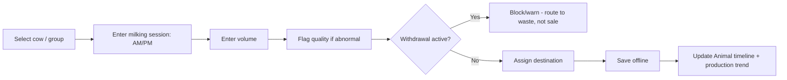

# Chapter 7 — Dairy Management

## 7.1 Purpose

Milk production is the primary daily production signal for cows (and goats, if enabled) and one of the strongest recurring health-correlation inputs (§4.4.3). This chapter specifies the Milk Production Workflow (concept note §12.3).

## 7.2 Milk Recording

The milk workflow supports:

- Morning and evening milking sessions
- Individual cow entry (primary) and group entry (fallback for large herds)
- Goat milk, if enabled for the farm
- Milk quality status (normal, abnormal — color, clots, blood)
- Milk destination: sale, processing, consumption, or waste
- Withdrawal-period warning at the point of recording (§3.3.4 RULE-BM-103)



### RULE-DAIRY-101 — Volume Is a Level A/B Observation

Milk volume SHALL be recorded as a quantitative Observation (§4.3.5), ideally Level A (milk meter) or Level B (measured container); a purely estimated volume is Level C and flagged as lower confidence in any resulting recommendation.

## 7.3 Production Trend and Cost per Liter

### REQ-DAIRY-101
FarmOS shall compute a rolling production trend per cow (e.g., 7-day average vs. current) and surface a Recommendation (Production category, §4.5.2) when yield declines beyond a configurable threshold, consistent with the correlation pattern example in §4.4.3.

### REQ-DAIRY-102
FarmOS shall compute cost per liter per cow (or herd average) from allocated feed and veterinary cost divided by recorded volume, supporting concept note §3 ("which animals are profitable?").

## 7.4 Withdrawal Period Enforcement

Per [Chapter 9 — Veterinary](../09-Veterinary/09-Veterinary-Management.md) and Behavioral Model RULE-BM-103, any milk recorded for an animal under an active withdrawal period is defaulted to "waste" destination and requires an explicit, logged override to mark it for sale or consumption.

## 7.5 Database Entities

| Entity | Key fields |
|---|---|
| milk_session | id, animal_id (nullable for group entry), session (AM/PM), volume, quality_status, destination, recorded_at, observation_id |
| milk_group_session | id, group_ref (herd/location), total_volume, animal_count, session, recorded_at |

## 7.6 API Sketch

```
POST /api/v1/dairy/milk-sessions              # individual entry
POST /api/v1/dairy/milk-sessions/group        # group entry
GET  /api/v1/dairy/animals/{id}/trend
GET  /api/v1/dairy/reports/daily
```

## 7.7 UI/UX Requirements

- Individual entry defaults to the previous session's volume as a pre-filled starting point workers adjust, reducing typing (Constitution Principle 12).
- A visible withdrawal-period badge appears on the cow's milking card before volume entry, not only after saving.
- Milk destination defaults sensibly (e.g., "sale" unless withdrawal-blocked) rather than requiring a selection every time.

## 7.8 Functional Requirements

### REQ-DAIRY-103
FarmOS shall support both AM and PM sessions as distinct events per cow per day, never overwriting one with the other.

### REQ-DAIRY-104
FarmOS shall block sale/consumption destination selection when an active withdrawal period exists, requiring an authorized override with a logged reason (§3.3.4).

## 7.9 Codex Implementation Notes

- Treat group entry as a convenience that still creates per-animal estimated shares when possible, or a clearly-scoped group record when not — never silently merge it into individual history.
- Reuse the Observation/Correlation/Recommendation infrastructure from Chapter 4 for production-decline detection; do not build dairy-specific alerting logic.
- Withdrawal-period checks must query the Veterinary domain (Chapter 9) at write time, not rely on a cached flag that could be stale after sync.

## 7.10 Acceptance Criteria

This chapter is satisfied when:

- A full herd's morning milking can be recorded in a time-boxed session appropriate for barn use.
- A production-decline recommendation is demonstrable from a realistic 3-day yield drop.
- A withdrawal-blocked sale attempt is demonstrably blocked at the point of entry.
