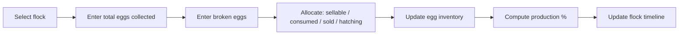

# Chapter 8 — Poultry Management

## 8.1 Purpose

Poultry (chickens, ducks, turkeys) are managed at the Flock level, not individually (Ontology §2.3.4-2.3.5, RULE-ONT-104). This chapter specifies the Egg Collection Workflow (concept note §12.4) and the Flock digital twin's production and health tracking.

## 8.2 Egg Collection Workflow

Per concept note §12.4, the workflow supports:

- Flock selection
- Species: chicken, duck, turkey
- Total eggs, broken eggs, sellable eggs
- Eggs consumed, eggs sold, eggs for hatching
- Egg inventory update
- Production percentage (eggs / bird-days)
- Feed conversion estimate



### RULE-POU-101 — Production Percentage Is Derived

Production percentage SHALL be computed as sellable + consumed + sold + hatching eggs divided by (bird count × days), not entered manually, so it stays consistent with the underlying collection events.

## 8.3 Flock Health and Withdrawal

Flock-level health observations (§4.3, e.g., mortality count, activity level, respiratory signs) and treatments/vaccinations (Chapter 9) apply to the whole Flock. Withdrawal periods block egg sale/consumption exactly as milk withdrawal blocks dairy sale (§7.4, RULE-BM-103).

## 8.4 Egg Decline Detection

Per concept note §3 ("which flock is underperforming in egg production?"), a decline in production percentage over a rolling window, optionally combined with feed intake decline or health observations, forms a correlation pattern (§4.4.3) producing a Production-category recommendation (§4.5.2).

## 8.5 Database Entities

| Entity | Key fields |
|---|---|
| flock | id, farm_id, species (chicken/duck/turkey), bird_count, location_id, status |
| egg_collection | id, flock_id, total_eggs, broken_eggs, consumed, sold, hatching, collected_at |
| flock_health_observation | id, flock_id, observation_type, value, observed_at |

## 8.6 API Sketch

```
GET  /api/v1/flocks?species=
GET  /api/v1/flocks/{id}
GET  /api/v1/flocks/{id}/timeline
POST /api/v1/flocks
POST /api/v1/poultry/egg-collections
GET  /api/v1/flocks/{id}/production-trend
```

## 8.7 UI/UX Requirements

- Egg collection entry is a single screen with numeric quick-entry fields, no more than the taps required for the fields in §8.2 (Constitution Principle 12).
- The flock profile shows production percentage trend as the primary chart, consistent with the milk trend chart pattern in Dairy (Chapter 7), for UI consistency across production domains.

## 8.8 Functional Requirements

### REQ-POU-101
FarmOS shall track egg collection per flock per day and compute production percentage automatically.

### REQ-POU-102
FarmOS shall support bird-count adjustments (mortality, culling, new birds added) as events, so historical production-percentage calculations remain accurate for the bird count at the time.

### REQ-POU-103
FarmOS shall block or warn against selling/consuming eggs from a flock under an active withdrawal period.

## 8.9 Codex Implementation Notes

- Bird count must be an event-sourced value (additions, mortality, culls, sales), not a single mutable integer, so historical production percentage remains correct even after the flock size changes (§3.2).
- Reuse the Feed Management (Chapter 6) distribution model directly for flock feeding — flocks are already a supported `entity_type` in `feed_distribution` (§6.6).
- Reuse the Dairy chapter's trend/decline detection approach rather than re-deriving it independently — the pattern (rolling window decline vs. correlation with feed/health signals) is identical.

## 8.10 Acceptance Criteria

This chapter is satisfied when:

- Egg collection can be recorded for chicken, duck, and turkey flocks using the same screen flow.
- Production percentage remains correct across a simulated bird-count change (mortality event).
- An egg-decline recommendation is demonstrable from a realistic multi-day drop.
