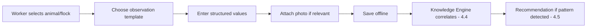

# Chapter 9 — Veterinary Management

## 9.1 Purpose

This chapter specifies the Health Observation Workflow and Treatment Workflow (concept note §12.5-12.6) — the domain where Constitution Principle 5 (Observation Before Diagnosis) is most safety-critical. It governs Health Observations, Treatments, Vaccinations, and Withdrawal Periods for both Animal and Flock entities.

## 9.2 Health Observation Workflow

Workers may record, per concept note §12.5: reduced appetite, limping, swelling, wound, coughing, nasal discharge, fever, low activity, abnormal milk, abnormal behavior, photo evidence, and notes.

### RULE-VET-101 — No Diagnosis Field for Workers

The Worker-facing health observation screen SHALL NOT present a diagnosis or condition-name field (e.g., "mastitis," "foot rot"). Only observation templates (§4.3.11) with structured, objective fields are available, per Constitution Principle 5.



## 9.3 Treatment Workflow

Per concept note §12.6, the treatment record supports: Animal or flock, symptom, diagnosis (veterinarian/authorized user only), medicine, dose, route, date, person responsible, withdrawal period, follow-up date, cost, notes, attachments.

### RULE-VET-102 — Diagnosis Is Veterinarian-Gated

The `diagnosis` field on a Treatment record SHALL only be writable by users with the Veterinarian role, or another role explicitly authorized per farm configuration (see [Chapter 17 — Security](../17-Security/17-Security.md)). Workers and Farm Managers cannot set this field, per Constitution Principle 5 and role table in [Behavioral Model §3.6](../03-Behavioral-Model.md#36-role-driven-behavior).

### RULE-VET-103 — Withdrawal Period Is Set at Treatment Time

Every Treatment referencing a Medicine SHALL derive a default withdrawal period from the Medicine's registered default (Ontology §2.3.8), adjustable by the authorized user, and SHALL propagate an active withdrawal window to the treated Animal/Flock for enforcement in Dairy (§7.4), Poultry (§8.3), and Sales ([Chapter 12](../12-Sales-Finance/12-Sales-and-Finance.md)).

## 9.4 Vaccination Records

Vaccinations are modeled as a Treatment subtype (medicine = vaccine) with protocol-based scheduling: a vaccination protocol defines the expected doses and intervals for a species, and FarmOS generates "vaccination due" recommendations (concept note §7, §19.1 Daily Review) when a scheduled dose is approaching or overdue.

## 9.5 Follow-Up and Outcome

Per the Knowledge Lifecycle (§4.2.9-4.2.11), every Treatment can have a follow-up date; recording the follow-up observation and its outcome (recovered, unchanged, deteriorated, diagnosis confirmed/incorrect) closes the loop back into the Feedback Loop (§4.9).

## 9.6 Database Entities

| Entity | Key fields |
|---|---|
| health_observation | id, entity_type, entity_id, template_id, values_json, observed_at, observer_id, photo_ids |
| medicine | id, name, default_withdrawal_days, species_applicability |
| treatment | id, entity_type, entity_id, symptom_ref, diagnosis (nullable, vet-gated), medicine_id, dose, route, administered_at, administered_by, withdrawal_end_at, follow_up_date, cost |
| vaccination_protocol | id, species, medicine_id, dose_sequence_json |
| withdrawal_period | id, entity_type, entity_id, treatment_id, starts_at, ends_at, status (active/expired/overridden) |

## 9.7 API Sketch

```
POST /api/v1/health-observations
POST /api/v1/treatments
PATCH /api/v1/treatments/{id}/diagnosis      # veterinarian-role only
GET  /api/v1/entities/{type}/{id}/withdrawal-status
GET  /api/v1/vaccinations/due
```

## 9.8 UI/UX Requirements

- Health observation templates are structured multi-select/numeric forms, not free-text, minimizing typing per Constitution Principle 12.
- A visible, persistent withdrawal-period badge appears on the Animal/Flock profile and on any Dairy/Poultry/Sales screen for that entity while active.
- Vaccination-due items appear in the Daily Review (§4.6.4.1) with one-tap access to record the dose.

## 9.9 Functional Requirements

### REQ-VET-101
FarmOS shall enforce diagnosis-field write access at the API layer, not only in the UI (§3.6 RULE-BM-106).
### REQ-VET-102
FarmOS shall compute and expose real-time withdrawal status for any Animal/Flock queried by Dairy, Poultry, or Sales domains.
### REQ-VET-103
FarmOS shall generate vaccination-due recommendations from protocol schedules without requiring manual date tracking by the farm manager.

## 9.10 Codex Implementation Notes

- Enforce RULE-VET-102 (diagnosis write access) with a server-side role check on the API endpoint, independent of any client-side field hiding.
- Compute withdrawal status as a derived query (`now() < withdrawal_end_at AND status = active`), not a manually toggled boolean that can go stale.
- Model vaccination as `treatment` rows with `medicine.is_vaccine = true`, not a separate parallel table, to keep timeline and cost aggregation unified.

## 9.11 Acceptance Criteria

This chapter is satisfied when:

- A Worker cannot submit a diagnosis through any available screen or API call.
- A withdrawal period created by a Treatment correctly blocks a subsequent Dairy or Poultry sale attempt.
- A vaccination-due recommendation appears for an animal approaching its next scheduled dose.
