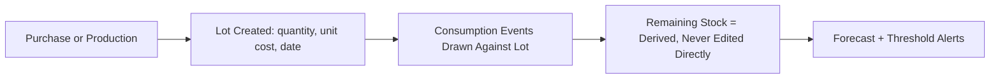

# Chapter 10 — Inventory Management

## 10.1 Purpose

Feed inventory is specified in [Chapter 6](../06-Feed/06-Feed-Management.md); this chapter generalizes the same Feed Lot pattern to Medicine and Product inventory, so FarmOS has one consistent inventory model rather than three bespoke ones (concept note §11.1: feed inventory, product inventory; §9: "inventory levels and shortages require manual tracking").

## 10.2 Inventory Lot: The General Pattern

Every stockable item — feed, medicine, product — follows the same lifecycle already defined for Feed Lots (§6.2-6.3):



### RULE-INV-101 — One Inventory Pattern, Three Applications

FarmOS SHALL implement a single generic Inventory Lot pattern (item, lot, consumption/movement event, derived remaining stock) and apply it to Feed Items, Medicines, and Products. Domain chapters (6, 9, 11, 12) reference this pattern rather than each defining their own stock-tracking logic.

## 10.3 Medicine Inventory

Medicine stock is drawn down by Treatment events (§9.6); a medicine running low triggers an Inventory-category recommendation (§4.5.2), especially relevant for medicines used in active vaccination protocols (§9.4).

## 10.4 Product Inventory

Product Inventory Lots are created by production events — milk destined for sale (Chapter 7), eggs destined for sale (Chapter 8), harvest batches (Chapter 11), and processed goods (cheese, labneh, yogurt, preserves — MVP-Light per [product/MVP_SCOPE.md](../../product/MVP_SCOPE.md)) — and drawn down by Sales events (Chapter 12).

## 10.5 Missing-Update Detection

Per [Behavioral Model §3.7](../03-Behavioral-Model.md#37-missing-data-behavior), an inventory movement expected but not recorded (e.g., no inventory update after a feed purchase) is itself a signal FarmOS should flag, not silently ignore.

## 10.6 Database Entities

Inventory reuses the Feed Lot pattern (§6.6) generalized:

| Entity | Key fields |
|---|---|
| inventory_item | id, farm_id, item_type (feed/medicine/product), name, unit |
| inventory_lot | id, inventory_item_id, source (purchase/production), quantity_received, unit_cost, received_at |
| inventory_movement | id, inventory_lot_id, movement_type (distribution/sale/waste/adjustment), quantity, entity_type, entity_id, moved_at |

`feed_lot`/`feed_distribution` (§6.6) may be implemented as this generalized model with `item_type = feed`, or as a thin domain-specific view over it — the physical implementation choice is deferred to [Chapter 14 — Database Architecture](../14-Database-Architecture/14-Database-Architecture.md).

## 10.7 API Sketch

```
GET  /api/v1/inventory/items?type=feed|medicine|product
GET  /api/v1/inventory/lots?item_id=
POST /api/v1/inventory/lots               # record purchase/production
POST /api/v1/inventory/movements          # generic consumption/sale/waste/adjustment
GET  /api/v1/inventory/items/{id}/forecast
```

## 10.8 UI/UX Requirements

- A single "Inventory" section lists all stockable items across feed, medicine, and product, filterable by type, rather than three disconnected screens.
- Low-stock warnings surface on the Morning Briefing (§3.4) using the same visual pattern regardless of item type.

## 10.9 Functional Requirements

### REQ-INV-101
FarmOS shall compute remaining stock for any Inventory Lot as received quantity minus all movement events against it.
### REQ-INV-102
FarmOS shall forecast days-of-stock-remaining per item using recent consumption rate and generate a threshold-based recommendation (default 7 days), consistent with §6.4 REQ-FEED-102.
### REQ-INV-103
FarmOS shall detect and flag expected-but-missing inventory movements (e.g., a purchase recorded with no corresponding stock-in movement).

## 10.10 Codex Implementation Notes

- Implement inventory as one generic module consumed by Feed (Chapter 6), Veterinary (Chapter 9), and Sales/Finance (Chapter 12) — do not let three teams/branches build three separate stock-tracking systems.
- Keep `inventory_movement` append-only; adjustments (e.g., stock count correction) are their own movement type, never an edit to a prior movement.
- The forecast algorithm (§10.9 REQ-INV-102) should be the same function used in Chapter 6 — implement once, parameterize by item type.

## 10.11 Acceptance Criteria

This chapter is satisfied when:

- Feed, medicine, and product stock all compute remaining quantity from the same underlying movement-log pattern.
- A low-stock recommendation is demonstrable for at least one item of each type (feed, medicine, product).
- Remaining stock for any item is always reproducible by replaying its lot and movement history.
