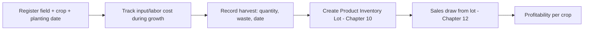

# Chapter 11 — Produce Management

## 11.1 Purpose

This chapter specifies fresh produce management: Field, Crop, and Harvest Batch entities (Ontology §2.3.6) and the Produce Workflow (concept note §12.7).

## 11.2 Entities

- **Field** — a Location (§2.2/2.3.2) used for planting.
- **Crop** — what is planted in a field for a season: planting date, expected harvest date.
- **Harvest Batch** — the output of harvesting: quantity, unit, waste quantity, and allocated input/labor/packaging cost.

## 11.3 Produce Workflow

Per concept note §12.7, the workflow supports: field, crop, planting date, harvest date, harvest quantity, unit, waste quantity, input cost, labor cost, packaging cost, sales, inventory, and profitability.



### RULE-PROD-101 — Harvest Creates an Inventory Lot

A Harvest Batch event SHALL create a corresponding Inventory Lot (§10.4) for the harvested Product, using the same generic inventory pattern as feed, medicine, and processed goods — not a separate produce-specific stock model.

## 11.4 Cost Allocation and Profitability

Per concept note §3 ("which crops or fresh produce generate the best margin?"), a Crop's profitability aggregates input cost, labor cost, and packaging cost against Harvest Batch sales revenue (Chapter 12). This is MVP-scoped as straightforward allocation, not full cost accounting (concept note §12.8: "the goal is not full accounting in MVP; the goal is decision-grade profitability").

## 11.5 Environmental Observations

Per concept note §9.1, environmental observations (e.g., "soil dry," "tomatoes showing yellow leaves") are recorded against a Field or Crop using the same generic Observation model (§4.3) as animal health observations, and can feed correlation patterns relevant to crop risk (e.g., low soil moisture + no recent rain note → irrigation recommendation).

## 11.6 Database Entities

| Entity | Key fields |
|---|---|
| field | id, farm_id, location_id, area, soil_notes |
| crop | id, field_id, crop_type, planting_date, expected_harvest_date, status |
| harvest_batch | id, crop_id, quantity, unit, waste_quantity, harvested_at, input_cost, labor_cost, packaging_cost |

## 11.7 API Sketch

```
GET  /api/v1/fields
POST /api/v1/crops
POST /api/v1/crops/{id}/harvests
GET  /api/v1/crops/{id}/profitability
POST /api/v1/fields/{id}/observations
```

## 11.8 UI/UX Requirements

- Harvest recording is a single screen: select crop, enter quantity/waste/unit, confirm — consistent with the low-friction pattern used in Dairy (Chapter 7) and Poultry (Chapter 8).
- Crop profitability is presented alongside animal/flock profitability in the same Monthly/Quarterly Review views (§4.6.4.3-4.6.4.4), not a separate produce-only report.

## 11.9 Functional Requirements

### REQ-PROD-101
FarmOS shall create an Inventory Lot automatically whenever a Harvest Batch is recorded.
### REQ-PROD-102
FarmOS shall compute crop profitability from input, labor, packaging cost against sales revenue for that crop's harvest batches.
### REQ-PROD-103
FarmOS shall support environmental observations scoped to Field or Crop entities using the standard Observation model.

## 11.10 Codex Implementation Notes

- Do not build a separate "produce inventory" table — reuse the generic Inventory Lot pattern (Chapter 10) with `item_type = product`.
- Keep cost allocation simple additive sums for MVP (input + labor + packaging), deferring more sophisticated cost-accounting models to Phase 2+ (see [product/ROADMAP.md](../../product/ROADMAP.md)).
- Field/Crop observations should use the same `observation` table and templates as animal health observations, scoped by `entity_type = Field` or `Crop`.

## 11.11 Acceptance Criteria

This chapter is satisfied when:

- A harvest can be recorded end-to-end and immediately appears as sellable inventory.
- Crop profitability can be computed and shown in a Monthly Review.
- A field-level environmental observation (e.g., soil dryness) can be recorded and appears on the field's timeline.
