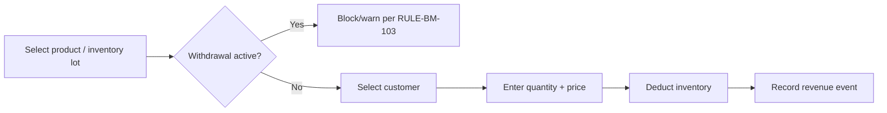

# Chapter 12 — Sales and Finance

## 12.1 Purpose

This chapter specifies the Sales and Expenses Workflow (concept note §12.8): quick recording of milk, egg, animal, produce, and processed-food sales, plus feed/medicine/vet/fuel/labor/equipment/other expenses, with Customer and Supplier entities (Ontology §2.3.10).

### RULE-FIN-101 — Decision-Grade, Not Full Accounting

Per concept note §12.8, FarmOS's Sales and Expenses module SHALL provide decision-grade profitability visibility (what sells, what costs, what margin), and SHALL NOT attempt full double-entry accounting, payroll, or tax compliance in the MVP (see [product/MVP_SCOPE.md](../../product/MVP_SCOPE.md) exclusions).

## 12.2 Sales

Sales draw from Inventory Lots (Chapter 10) created by Dairy (Chapter 7), Poultry (Chapter 8), or Produce (Chapter 11):



Supported sale types (concept note §12.8): milk sales, egg sales, animal sales, produce sales, cheese/labneh/preserved food sales.

### RULE-FIN-102 — Sales Are Withdrawal-Gated

Any Sale referencing milk, eggs, or meat from an Animal/Flock under an active withdrawal period SHALL be blocked by default, consistent with RULE-BM-103 (§3.3.4), RULE-DAIRY-104 (§7.8), and RULE-POU-103 (§8.9).

## 12.3 Expenses

Supported expense categories (concept note §12.8): feed purchases, medicine purchases, vet expenses, fuel expenses, labor expenses, equipment expenses, other farm expenses. Feed and medicine purchases additionally create Inventory Lots (§10.2-10.3); other expenses are recorded without an inventory side effect.

## 12.4 Customers and Suppliers

Customers (Ontology §2.3.10) are referenced by Sales; Suppliers are referenced by Expenses/purchases. Both are simple entities in the MVP (name, contact, notes) — no credit terms, invoicing, or payment-plan management (excluded per concept note §11.3).

## 12.5 Profitability

Per concept note §3 and §18, FarmOS aggregates:

- Animal/flock profitability (acquisition + allocated feed + allocated vet cost vs. sale/production revenue) — extends §5.8 and Chapter 7/8.
- Product profitability (unit cost vs. sale price).
- Crop profitability (§11.4).
- Farm-level profitability summary (total sales vs. total expenses by category).

### RULE-FIN-103 — Profitability Is Computed, Not Manually Entered

All profitability figures SHALL be computed from underlying Sale, Expense, and allocated-cost records. FarmOS SHALL NOT provide a manual "enter profit" override field, to preserve traceability (Constitution Principle 15).

## 12.6 Database Entities

| Entity | Key fields |
|---|---|
| customer | id, farm_id, name, contact_info |
| supplier | id, farm_id, name, contact_info |
| sale | id, product_ref/inventory_lot_id, customer_id, quantity, unit_price, sold_at, entity_type, entity_id (for animal sales) |
| expense | id, category (feed/medicine/vet/fuel/labor/equipment/other), supplier_id, amount, incurred_at, related_inventory_lot_id (nullable) |

## 12.7 API Sketch

```
POST /api/v1/sales
POST /api/v1/expenses
GET  /api/v1/customers
GET  /api/v1/suppliers
GET  /api/v1/finance/profitability?scope=animal|flock|product|crop|farm
GET  /api/v1/finance/reports/summary
```

## 12.8 UI/UX Requirements

- Sale and Expense recording are both reachable as single quick actions ("Sell," "Record Expense") from the Morning Briefing quick-action set (§3.4, concept note §17).
- Withdrawal-blocked sale attempts show the same visible badge/warning pattern used in Dairy and Poultry (§7.8, §8.7), for UI consistency.
- Profitability views default to the current month, with drill-down to underlying sales/expenses — never a black-box number with no supporting detail (consistent with Constitution Principle 8 applied to financial, not just health, reasoning).

## 12.9 Functional Requirements

### REQ-FIN-101
FarmOS shall record Sales and Expenses fully offline, syncing per the standard event-sourced sync model ([Chapter 16](../16-Offline-Synchronization/16-Offline-Synchronization.md)).
### REQ-FIN-102
FarmOS shall block withdrawal-period sales at entry time across all product types (milk, eggs, animal, meat).
### REQ-FIN-103
FarmOS shall compute profitability summaries at animal, flock, product, crop, and farm scope from underlying transactional data.

## 12.10 Codex Implementation Notes

- Do not build separate sale/expense tables per product type (milk sale, egg sale, etc.); one `sale` entity with a product/entity reference, consistent with the "generic pattern, applied per domain" approach used in Chapters 6/10.
- Withdrawal checks in this chapter must call the same withdrawal-status API defined in Veterinary (§9.7), not reimplement the check.
- Keep the MVP finance model additive and simple; resist the temptation to add accrual accounting, multi-currency, or tax logic before Phase 2+ (see [product/ROADMAP.md](../../product/ROADMAP.md)).

## 12.11 Acceptance Criteria

This chapter is satisfied when:

- A sale and an expense can each be recorded in under three taps for the common case.
- A withdrawal-blocked sale is blocked regardless of which product type (milk, egg, animal, meat) it originates from.
- Farm-level, animal-level, and crop-level profitability can each be computed and displayed from real transactional data.
