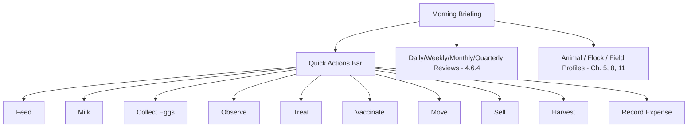

# Chapter 13 — UI/UX Design System

## 13.1 Purpose

This chapter consolidates the UI/UX requirements scattered through Chapters 1-12 into one coherent design system, so every screen — regardless of which domain chapter specified it — feels like one product, not twelve.

## 13.2 The One-Hand Barn Test

Every screen must pass the test from [Vision §1.6.3](../01-Vision.md#163-tablet-first):

> If a worker cannot complete the task with one hand while standing in the barn, the design is wrong.

Concretely, this means: large touch targets (minimum 48dp), no fine-motor gestures required for core workflows, no reliance on a stylus or keyboard for common actions, and confirmation via large buttons rather than small checkboxes.

## 13.3 Navigation Model

### RULE-UX-101 — Morning Briefing Is the Home Screen

The app SHALL open to the Morning Briefing (§3.4), not a generic dashboard or menu. All navigation flows outward from "Start My Day" into task-driven workflows, and back.

## 13.4 Core Components

| Component | Used by | Requirement |
|---|---|---|
| Recommendation card | §4.5.9, all domain chapters | Entity, priority/confidence badges, one-line explanation, accept/reject/monitor actions, no scrolling for the primary action |
| Timeline | §4.8.6 | Same component reused across Animal, Flock, Field profiles |
| Observation template form | §4.3.16 | Numeric/structured inputs, minimal typing, photo attach |
| Quick-action button bar | §13.3, concept note §17 | Consistent icon + label set across the whole app |
| Withdrawal-period badge | §7.8, §8.7, §9.8, §12.8 | Same visual treatment everywhere it appears |
| Confidence band indicator | §4.7.7 | Consistent color coding (e.g., green/amber/red) app-wide |
| Offline status indicator | §13.6 | Always visible, never hidden in a menu |

### RULE-UX-102 — One Component, Many Domains

A UI pattern used in more than one domain chapter (recommendation cards, timelines, withdrawal badges, confidence indicators) SHALL be implemented once as a shared component, not reimplemented per domain screen.

## 13.5 Visual Language

- Large cards over dense tables for anything worker-facing.
- Icon + short label for every quick action; icons are consistent across languages (§13.7).
- Simple, high-contrast colors readable in direct sunlight (an outdoor/barn use consideration).
- Dark/light mode is explicitly deferred (concept note §17), not required for MVP.

## 13.6 Offline Status Visibility

### RULE-UX-103 — Connectivity State Is Always Visible

The current sync/connectivity state (offline, syncing, synced) SHALL be visible from any screen, consistent with Constitution Principle 10 (Offline First) and [Chapter 16 — Offline Synchronization](../16-Offline-Synchronization/16-Offline-Synchronization.md). Workers must never wonder whether their entry was saved.

## 13.7 Bilingual and RTL Support

### RULE-UX-104 — Arabic and English From Day One

Every screen SHALL support both English and Arabic, including right-to-left layout mirroring for Arabic, per Constitution Principle 11/concept note §4.3. Text strings SHALL be externalized (no hard-coded UI strings) from the first screen built, not retrofitted later.

## 13.8 QR-First Lookup

### RULE-UX-105 — QR Is the Default Entity Lookup Path

Animal, Flock, Location, and Feed Lot lookup (Ontology §2.7 REQ-ONT-202) SHALL present QR scanning as the default, one-tap entry point, with text/name search as the fallback, not the other way around.

## 13.9 Functional Requirements

### REQ-UX-101
The UI framework shall support offline-capable rendering with no dependency on a live network call to display previously synced screens.
### REQ-UX-102
Every user-facing string shall be sourced from a translation resource, not hard-coded, supporting English and Arabic at minimum.
### REQ-UX-103
Shared components (§13.4) shall be implemented once in a common component library, consumed by every domain screen.

## 13.10 Codex Implementation Notes

- Build the shared component library (recommendation card, timeline, withdrawal badge, confidence indicator, offline indicator) before building domain-specific screens; domain chapters 5-12 all depend on it.
- Externalize all strings via a standard i18n mechanism from the first commit; retrofitting bilingual support later is significantly more expensive.
- Test every core workflow screen one-handed on an actual Android tablet, not only in a desktop browser emulator, before considering it done (see [Chapter 18 — Testing](../18-Testing/18-Testing.md)).

## 13.11 Acceptance Criteria

This chapter is satisfied when:

- The app opens directly to the Morning Briefing.
- Every domain chapter's UI requirements are satisfied by the shared component library, not duplicated per-screen implementations.
- The app is fully usable in both English and Arabic, including RTL layout.
- A worker can complete each MVP quick action (§13.3) one-handed on a tablet.
