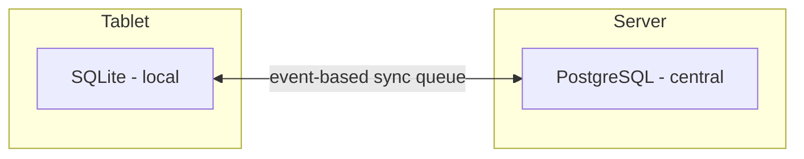

# Chapter 14 — Database Architecture

## 14.1 Purpose

This chapter defines the physical database architecture implementing the entities and behaviors specified in Chapters 2-12: local SQLite on the tablet, central PostgreSQL as the source of truth once synced, and the schema conventions every domain table must follow.

## 14.2 Two-Tier Database Model

Per concept note §14, the local database is SQLite (fast, embedded, works fully offline); the central database is PostgreSQL (multi-user, backed up, queryable for reporting). Both share the same logical schema; physical differences (SQLite has no native UUID/JSONB types, for example) are handled at the ORM/migration layer, not by diverging the schema design.

### RULE-DB-101 — Schema Parity

The local and central schemas SHALL represent the same entities and relationships. Divergence is only acceptable for storage-engine-specific type mapping (e.g., UUID stored as TEXT in SQLite), never for business logic.

## 14.3 Standard Table Conventions

Every domain table introduced in Chapters 2-12 follows these conventions:

| Convention | Rule |
|---|---|
| Primary key | Client-generatable UUID (not an auto-increment integer), so offline-created records never collide on sync (§16.3) |
| `farm_id` | Present on every table, even with one farm in the MVP, to avoid a costly Phase 8 multi-farm migration |
| `created_at` / `updated_at` | Present on every table; `updated_at` reflects the latest correction event, never a silent overwrite (§3.2 RULE-BM-101) |
| Soft status, not hard delete | Entities use an `active`/`archived`/lifecycle-state field (§2.9, §3.3); rows are never physically deleted |
| Event tables are append-only | Observation, treatment, sale, expense, inventory_movement, and similar event tables SHALL NOT support UPDATE on business-meaning fields, only INSERT of new correcting rows |

## 14.4 Event-Sourced vs. Projected Tables

Per [Behavioral Model §3.2](../03-Behavioral-Model.md#32-the-governing-rule-nothing-changes-without-an-event), FarmOS distinguishes:

- **Event tables** (append-only): `observation`, `treatment`, `sale`, `expense`, `feed_distribution`, `inventory_movement`, `breeding_event`.
- **Projected/derived views**: current animal status, remaining inventory stock, production trend — computed from event tables, never stored as independently editable fields (RULE-BM-102).

### RULE-DB-102 — Derived Fields Are Recomputable

Any column holding a "current state" or "current total" value must be reproducible by a documented query over its source event table(s). If a projected value cannot be derived this way, the schema is wrong.

## 14.5 Identifier Strategy

### RULE-DB-103 — Client-Generated IDs

All primary keys SHALL be generated client-side (UUID v4 or similar) at creation time, not server-assigned, so that a worker recording an event fully offline never needs a round-trip to obtain an ID (Constitution Principle 10 — Offline First).

## 14.6 Indexing and Query Patterns

Given the workload described in Chapters 5-12 (per-entity timeline queries, per-item inventory forecasts, per-pattern recommendation accuracy), the central database indexes at minimum:

- `(entity_type, entity_id, observed_at)` on `observation` and similar event tables, for timeline queries (§4.8).
- `(farm_id, status)` on lifecycle-bearing entities, for morning briefing/review queries (§4.6).
- `(inventory_lot_id, moved_at)` on `inventory_movement`, for stock derivation (§10.9).

## 14.7 Functional Requirements

### REQ-DB-101
The local SQLite schema shall support full CRUD for all MVP entities and events with zero network dependency.
### REQ-DB-102
Every entity and event table shall include `farm_id`, a client-generated UUID primary key, `created_at`, and an appropriate lifecycle/status field.
### REQ-DB-103
Migrations shall be versioned and applied identically to local and central schemas, keeping schema parity (RULE-DB-101).

## 14.8 Codex Implementation Notes

- Use a single migration toolchain (e.g., Alembic) targeting both the PostgreSQL and SQLite schemas from one source of truth, rather than maintaining two hand-written schemas.
- Do not use auto-increment integer primary keys anywhere a record might be created offline.
- Materialize expensive derived views (e.g., production trend) as periodically refreshed read models if query performance requires it, but always alongside a documented recomputation path from raw events.

## 14.9 Acceptance Criteria

This chapter is satisfied when:

- Every table introduced across Chapters 2-12 exists in both local and central schemas with parity.
- No table stores a "current state" value that cannot be recomputed from its event history.
- A full offline write-then-sync cycle can be demonstrated without ID collisions.
