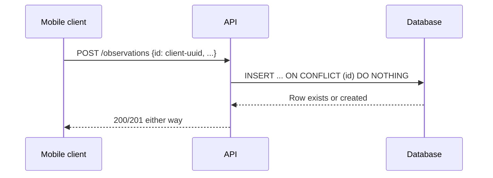

# Chapter 15 — API Architecture

## 15.1 Purpose

This chapter defines the conventions behind the `/api/v1/...` endpoint sketches introduced throughout Chapters 5-12, so the backend (FastAPI, per concept note §14) presents one consistent API rather than twelve domain-specific styles.

## 15.2 Technology

Per concept note §14: FastAPI (or similar), with OpenAPI-generated documentation as the single source of truth for request/response contracts, consumed by both the mobile client and any future integrations.

### RULE-API-101 — OpenAPI Is Authoritative

The OpenAPI specification generated from the backend SHALL be the authoritative contract. Handbook API sketches (as in Chapters 5-12) are illustrative and non-binding; the generated spec governs actual client implementation.

## 15.3 Resource Conventions

- Base path: `/api/v1/`.
- Resources are plural nouns matching Ontology entities (`/animals`, `/flocks`, `/observations`, `/treatments`, `/sales`, ...).
- Standard verbs: `GET` (list/detail), `POST` (create event/entity), `PATCH` (narrow, explicitly-permitted field updates only, e.g., diagnosis per RULE-VET-102), never `PUT` full-replace on event-sourced entities (§14.4).
- Nested/derived views use sub-resources (`/animals/{id}/timeline`, `/crops/{id}/profitability`, `/feed-items/{id}/forecast`) rather than overloaded query parameters.

## 15.4 Authentication and Authorization

### RULE-API-102 — Role Enforcement at the API Layer

Every endpoint enforces role-based permissions (§17) server-side, independent of any client-side UI restriction (§3.6 RULE-BM-106, §9.9 REQ-VET-101). A request from a Worker-role token attempting to set a diagnosis field, for example, is rejected at the API regardless of what the mobile client renders.

## 15.5 Offline-Aware Write Semantics

### RULE-API-103 — Idempotent Sync Writes

Because writes may be created offline and replayed later (§16), every write endpoint accepts the client-generated ID (§14.5 RULE-DB-103) and SHALL be idempotent: replaying the same event with the same ID is a no-op, not a duplicate.

## 15.6 Error Format

All error responses share one structure: `{ "error": { "code": "...", "message": "...", "field_errors": [...] } }`, so the mobile client can render consistent validation feedback across every domain workflow, rather than parsing twelve different error shapes.

## 15.7 Pagination and Filtering

List endpoints (e.g., `/animals`, `/observations`) support cursor-based pagination and consistent filter query parameters (`entity_type`, `entity_id`, `status`, date ranges), matching the patterns already used across Chapters 5-12's API sketches.

## 15.8 Functional Requirements

### REQ-API-101
The backend shall generate and publish an OpenAPI specification kept in sync with the implemented endpoints.
### REQ-API-102
Every write endpoint shall accept a client-generated ID and be idempotent under retry.
### REQ-API-103
Every endpoint shall enforce role-based access control server-side, regardless of client behavior.

## 15.9 Codex Implementation Notes

- Use FastAPI's automatic OpenAPI generation directly; do not hand-maintain a separate API spec document that can drift.
- Implement idempotent writes via upsert-on-conflict at the database layer (§15.5), not via application-level "check then insert" logic that races under concurrent sync.
- Centralize role-check middleware/dependencies so every new domain endpoint inherits enforcement automatically rather than re-implementing checks per route.

## 15.10 Acceptance Criteria

This chapter is satisfied when:

- All domain endpoints sketched in Chapters 5-12 are implemented consistently with these conventions.
- A replayed offline write (same client ID, sent twice) produces no duplicate record.
- A role-restricted field (e.g., diagnosis) cannot be set via direct API call by an unauthorized role, independent of the mobile client.
