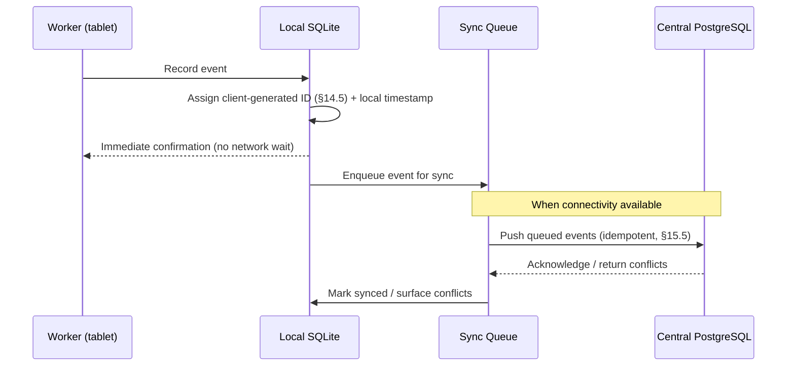
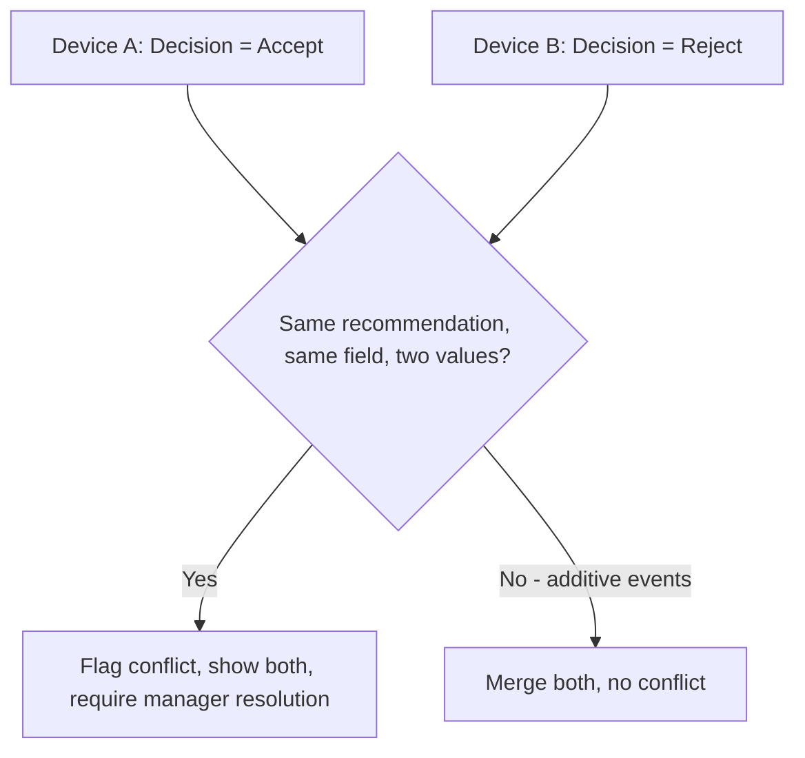

# Chapter 16 — Offline Synchronization

## 16.1 Purpose

This chapter specifies the event-based sync queue referenced throughout the handbook (concept note §14, [Behavioral Model §3.5](../03-Behavioral-Model.md#35-offline-behavior)) — the mechanism that lets every workflow in Chapters 5-12 work fully offline and reconcile with the central database when connectivity returns.

## 16.2 Local-First Write Path

Every write (observation, feed distribution, milk session, egg collection, treatment, sale, expense, ...) follows the same path, already introduced in §3.5.1:

### RULE-SYNC-101 — Local Save Is Never Blocked by Network

No workflow screen SHALL wait on a network call to confirm a save to the user. Confirmation is based on the local write succeeding; sync happens asynchronously.

## 16.3 Sync Queue Structure

The sync queue is a local, ordered log of pending outbound events, each carrying: the event's client-generated ID, entity type, payload, local timestamp, and a sync status (pending, syncing, synced, conflict). This queue is itself just another local table, subject to the same conventions as §14.3.

## 16.4 Conflict Handling

### RULE-SYNC-102 — No Silent Overwrites

Per [Behavioral Model RULE-BM-105](../03-Behavioral-Model.md#35-offline-behavior), when two offline sources modify related state for the same entity before either syncs, FarmOS SHALL preserve both events with their original local timestamps and flag the conflict for manager review, never silently choosing one and discarding the other.

Because most FarmOS writes are additive events (a new observation, a new sale) rather than field overwrites (§14.4), true conflicts are rare by construction — the event-sourced model sidesteps most last-write-wins problems. Conflicts that do occur (e.g., two devices both attempt to close the same Recommendation with different Decisions) are surfaced explicitly:

## 16.5 Sync Status Visibility

Per [Chapter 13 §13.6](../13-UI-UX-Design-System/13-UI-UX-Design-System.md#136-offline-status-visibility) (RULE-UX-103), the current sync state is always visible to the user: count of pending items, last successful sync time, and any flagged conflicts requiring attention.

## 16.6 Connectivity Detection and Retry

### RULE-SYNC-103 — Backoff, Not Hammering

The sync client SHALL detect connectivity changes and attempt sync opportunistically, using exponential backoff on failure, rather than continuously polling a server that may be unreachable for extended periods (a farm may be offline for days).

## 16.7 Functional Requirements

### REQ-SYNC-101
FarmOS shall queue all offline-created events locally and sync them automatically upon connectivity, without requiring manual user action.
### REQ-SYNC-102
FarmOS shall preserve original local timestamps through sync, distinct from server-received timestamps, for accurate historical ordering.
### REQ-SYNC-103
FarmOS shall flag, not silently resolve, any genuine field-level conflict (as opposed to additive-event merges).
### REQ-SYNC-104
FarmOS shall display current sync status (pending count, last sync, conflicts) from any screen.

## 16.8 Codex Implementation Notes

- Model most domain writes as additive events specifically to avoid conflict-resolution complexity — this is why Chapters 5-12 consistently model workflows as new rows in event tables rather than field updates (§14.4).
- Implement the sync queue as a durable local table (not an in-memory queue that could be lost on app restart mid-sync).
- Reserve conflict UI/resolution flows for the few genuinely non-additive cases (e.g., competing Decisions on the same Recommendation, §4.6.3) rather than building a general-purpose merge UI that most workflows will never need.

## 16.9 Acceptance Criteria

This chapter is satisfied when:

- A full day's worth of offline workflow activity (feeding, milking, egg collection, observations, sales) can be recorded with zero connectivity and syncs correctly once connectivity returns.
- A simulated field-level conflict (competing Decisions) is flagged for manager review rather than silently resolved.
- Sync status is visible and accurate from the Morning Briefing and any workflow screen.
