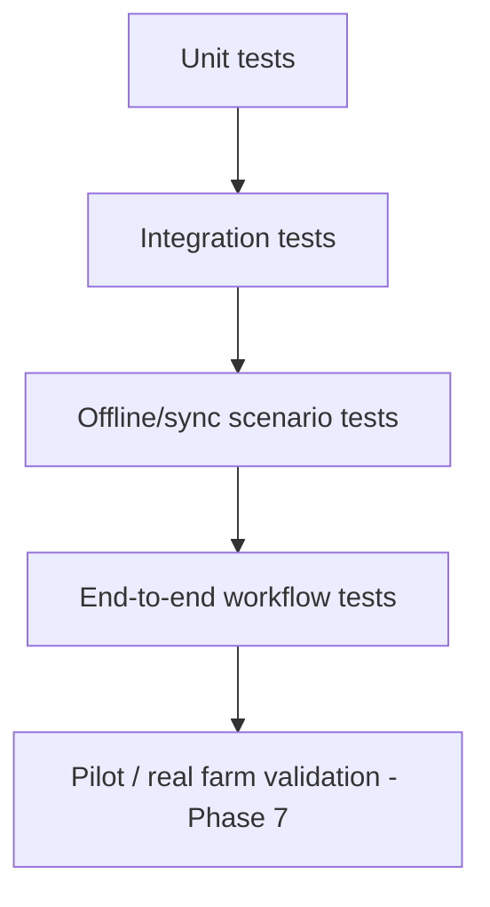

# Chapter 18 — Testing

## 18.1 Purpose

This chapter defines how FarmOS is tested, using the acceptance criteria already stated at the end of every handbook chapter as the primary source of test cases, rather than inventing a parallel test specification.

### RULE-TEST-101 — Acceptance Criteria Are Test Cases

Every "Acceptance Criteria" section (found at the end of Chapters 1-17) SHALL map to one or more automated or manual test cases in [product/TRACEABILITY.md](../../product/TRACEABILITY.md). A chapter is not "done" until its acceptance criteria are demonstrated, not merely implemented.

## 18.2 Test Layers

| Layer | Focus | Example |
|---|---|---|
| Unit | Pure logic: correlation pattern matching (§4.4), confidence scoring (§4.7.3), profitability computation (§12.5) | Given fixed observations, does the pattern matcher produce the expected Knowledge Object? |
| Integration | API + database behavior | Does a treatment with a medicine correctly set a withdrawal period (§9.3) blocking a subsequent sale (§12.2)? |
| Offline/sync | The behaviors specified in Chapter 16 | Record events fully offline, sync, verify no data loss and correct conflict flagging |
| End-to-end | Full workflow screens | Complete a feeding, milking, egg collection, and sale in sequence on a test device |
| Pilot validation | Real farm use (Phase 7) | Does the Morning Briefing genuinely reflect what happened yesterday, on the real farm? |

## 18.3 Priority Test Scenarios

Given the domains most tied to safety and trust (Constitution Principles 5-8), these scenarios are non-negotiable before any release:

### RULE-TEST-102 — Mandatory Scenario Coverage

The following scenarios SHALL have passing automated tests before a release is considered MVP-complete:

1. A Worker cannot submit a diagnosis through any UI path or direct API call (§9.2 RULE-VET-101, §9.9 REQ-VET-101).
2. A sale of milk/eggs/meat from an entity under an active withdrawal period is blocked by default (§3.3.4 RULE-BM-103, and its Chapter 7/8/12 restatements).
3. No recommendation is displayed without evidence, confidence, and a suggested action (§4.7.2 RULE-KM-701).
4. A full day of offline activity syncs without data loss or silent overwrite (§16.9).
5. Every derived/current-state value (animal status, inventory stock, production trend) is reproducible by replaying its source events (§14.4 RULE-DB-102).

## 18.4 Test Data

Test fixtures reflect the mixed-farm reality Origami Farms actually has (Constitution Principle 16): cows, sheep, goats, horses, chickens, ducks, turkeys, and at least one crop, so that no domain chapter is validated only against a single-species assumption.

## 18.5 Functional Requirements

### REQ-TEST-101
The project shall maintain automated test coverage for every RULE-* defined across Chapters 1-17, prioritizing the mandatory scenarios in §18.3.
### REQ-TEST-102
The project shall maintain a realistic, mixed-species test fixture set covering all MVP entity types (Ontology §2.3).
### REQ-TEST-103
Offline/sync tests shall run against the same local SQLite / central PostgreSQL pairing used in production, not a simplified mock.

## 18.6 Codex Implementation Notes

- Write the mandatory scenarios in §18.3 as executable tests before building the corresponding feature, where practical (test-first for safety-critical rules).
- Reuse the same test fixture set across domain chapters (one shared "Origami Farms test dataset") rather than each chapter inventing its own isolated fixtures.
- Track acceptance-criteria-to-test-case mapping in [product/TRACEABILITY.md](../../product/TRACEABILITY.md) so a reviewer can see, for any handbook section, which test proves it.

## 18.7 Acceptance Criteria

This chapter is satisfied when:

- Every mandatory scenario in §18.3 has a passing automated test.
- Every chapter's acceptance criteria are traceable to at least one test case in product/TRACEABILITY.md.
- Test fixtures cover every MVP-supported species and domain.
