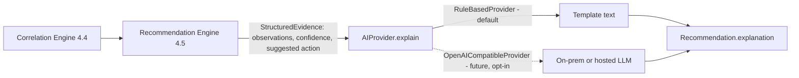

# ADR-010 — AI Integration Architecture

## Status

Accepted

## Context

The MVP recommendation engine is rule-based by design ([4.5.6 RULE-KM-502](../04-Knowledge-Model/04.5-Recommendation-Engine.md#456-mvp-approach-rule-based-not-machine-learned)), and [4.10 AI Governance](../04-Knowledge-Model/04.10-AI-Governance.md) requires any future model component to satisfy explainability parity, a human review gate, confidence calibration, auditability, and reversibility before it can generate recommendations. Separately, there is a stated future requirement to integrate OpenAI, potentially hosted on-premises (i.e., an OpenAI-compatible inference endpoint run on Origami Farms' own infrastructure rather than the public OpenAI API), for reasons including farm data privacy — Chapter 4.10 §4.10.4 already restricts pooling farm data externally without a separately governed decision. The implementation must not let this future requirement compromise the rule-based engine's independence or the explanation contract (§4.7.2).

## Decision

Introduce a narrow `AIProvider` interface at the service layer, with exactly one responsibility in this phase: **turning already-computed, structured evidence into natural-language explanation text.** It does not decide confidence, does not select the recommendation, and does not invent evidence — those remain the exclusive responsibility of the rule-based Correlation Engine (§4.4) and Recommendation Engine (§4.5).

```
AIProvider (interface)
  explain(evidence: StructuredEvidence) -> ExplanationText

RuleBasedProvider (default, always available)
  - Template-driven explanation generation (string formatting over evidence),
    used when no richer provider is configured. Satisfies §4.7.2 on its own,
    with zero external dependency.

OpenAICompatibleProvider (optional, disabled by default)
  - Calls a configurable base_url + api_key using the OpenAI Chat Completions
    wire format. Because this is the OpenAI *API shape*, not the OpenAI
    *service*, the same client code works against:
      - the hosted OpenAI API, or
      - a self-hosted, on-premises OpenAI-compatible server (e.g., vLLM,
        Ollama, or a similar local inference server), by changing base_url
        and api_key only.
  - Input: the same StructuredEvidence the RuleBasedProvider receives.
  - Output: explanation text only. The prompt template forbids introducing
    facts not present in the evidence payload, and the caller discards any
    confidence/recommendation the model might hallucinate — those fields are
    always sourced from the Recommendation Engine, never from this provider.
```



### RULE-AI-1001 — Evidence and Confidence Never Originate From the AIProvider

The `AIProvider` interface SHALL accept fully-computed evidence and confidence as input and SHALL only return explanation text. No implementation of this interface may originate an evidence item, a confidence score, or a suggested action — those remain outputs of the Correlation/Recommendation Engines per [4.10 RULE-KM-1001](../04-Knowledge-Model/04.10-AI-Governance.md#4102-scope-of-ai-in-farmos).

### RULE-AI-1002 — On-Premises Compatibility Is a Configuration Concern, Not a Code Fork

The `OpenAICompatibleProvider` SHALL be configured entirely through `base_url` and `api_key` (plus model name), so switching between the hosted OpenAI API and a future on-premises OpenAI-compatible endpoint requires an environment variable change, never a code change.

### RULE-AI-1003 — Rule-Based Provider Is Always the Fallback

Per [4.10 RULE-KM-1002](../04-Knowledge-Model/04.10-AI-Governance.md#4103-governance-requirements-for-any-model-introduced-post-mvp), if the `OpenAICompatibleProvider` is unconfigured, unreachable, or errors, the system SHALL fall back to `RuleBasedProvider` automatically rather than failing to produce a recommendation or blocking the workflow.

### RULE-AI-1004 — Disabled by Default

`OpenAICompatibleProvider` SHALL ship disabled (no default API key/endpoint configured). Enabling it is an explicit, farm-level configuration decision, consistent with data-governance requirements in §4.10.4 (no farm data leaves the premises without a deliberate, reviewed choice).

## Consequences

- This phase implements and ships only `RuleBasedProvider`. `OpenAICompatibleProvider` is included as a working, tested implementation behind the same interface, but disabled, so the integration path is real (not just documented) without being active.
- Because the interface boundary is "evidence in, text out," swapping or adding providers later (a genuinely on-premises LLM, a different vendor, a locally fine-tuned model) never touches the Correlation or Recommendation Engines, satisfying [4.10 §4.10.3](../04-Knowledge-Model/04.10-AI-Governance.md#4103-governance-requirements-for-any-model-introduced-post-mvp)'s explainability-parity and reversibility requirements by construction.
- Every Recommendation still records which provider produced its explanation text (`explanation_provider` field), satisfying the model-version auditability requirement (REQ-KM-1002) even though, in this phase, that field will only ever read `rule_based`.

## Alternatives Considered

### Let the LLM Also Decide Confidence and Priority

Rejected outright: directly contradicts Constitution Principle 17 (AI Is a Copilot) and 4.10's structural prohibition on AI-originated diagnosis/decisions. Confidence and priority must stay computed, auditable, and reproducible (§4.4.5, §4.5.5).

### Build the OpenAI Integration Now, Enabled by Default

Rejected: no farm data governance review has taken place yet (§4.10.4), and the concept note's own MVP exclusions list "advanced machine learning" as explicitly out of scope for the MVP ([product/MVP_SCOPE.md](../../product/MVP_SCOPE.md)). Shipping the interface and a tested-but-disabled implementation satisfies the "future integration" requirement without jumping ahead of governance.

### No Abstraction — Hard-Code Against the OpenAI SDK Directly if/when Needed

Rejected: would make an on-premises swap later a code change instead of a configuration change, violating RULE-AI-1002 and creating avoidable rework.

## Related Documents

- ../04-Knowledge-Model/04.5-Recommendation-Engine.md
- ../04-Knowledge-Model/04.7-Explainable-AI.md
- ../04-Knowledge-Model/04.10-AI-Governance.md
- ADR-007-Explainable-Intelligence.md
- ADR-009-Technology-Stack-Selection.md
